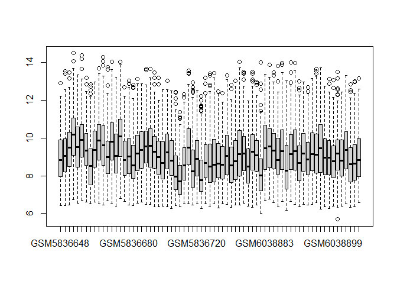
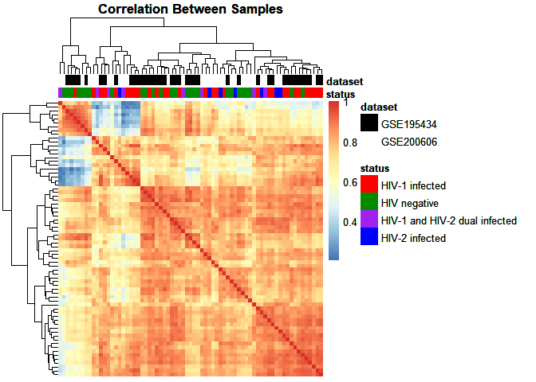
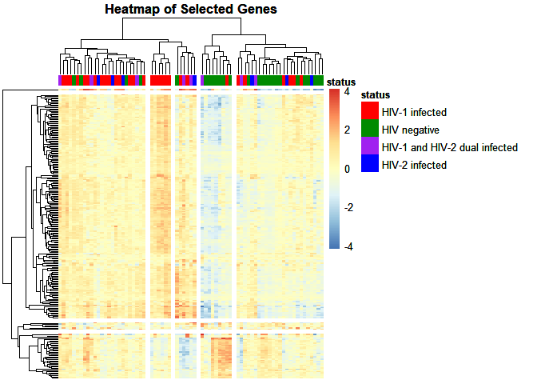
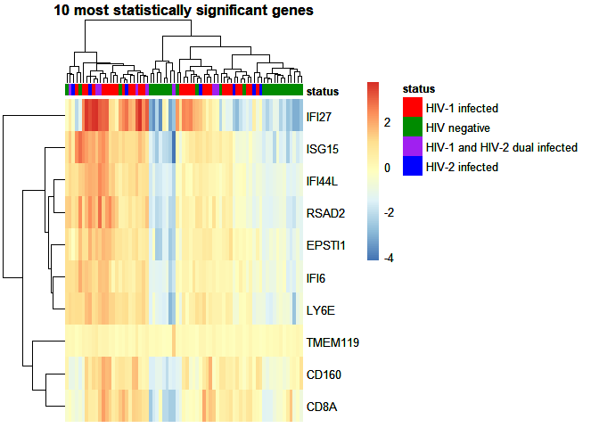
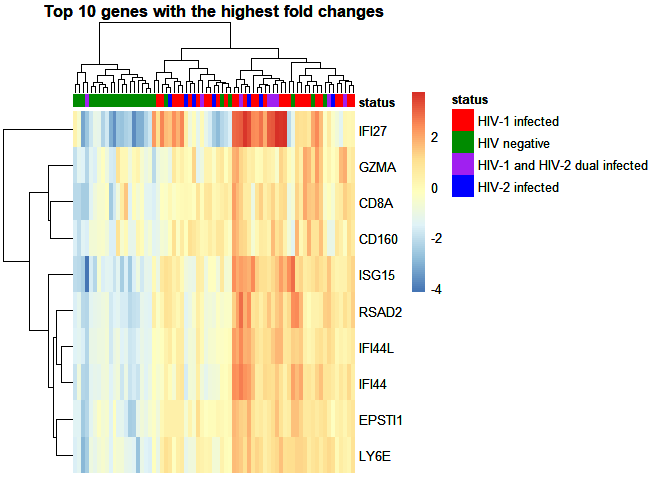
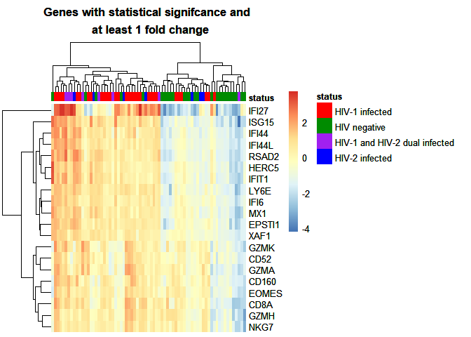
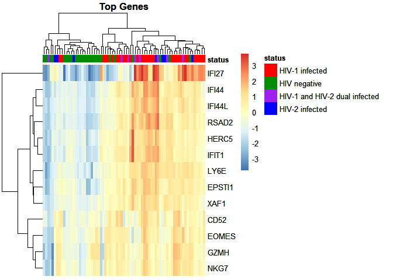

Data Analysis
================
2025-06-17

``` r
knitr::opts_chunk$set(echo = TRUE)
```

## R Markdown

``` r
library(dplyr)
```

    ## 
    ## Attaching package: 'dplyr'

    ## The following objects are masked from 'package:stats':
    ## 
    ##     filter, lag

    ## The following objects are masked from 'package:base':
    ## 
    ##     intersect, setdiff, setequal, union

``` r
library(gprofiler2)
library(pheatmap)
library(ggplot2)
library(ggrepel)
library(sqldf)
```

    ## Loading required package: gsubfn

    ## Loading required package: proto

    ## Loading required package: RSQLite

``` r
library(limma)
library(dplyr)
library(tidyr)
library(gprofiler2)
library(PCAtools)
```

    ## 
    ## Attaching package: 'PCAtools'

    ## The following objects are masked from 'package:stats':
    ## 
    ##     biplot, screeplot

``` r
library(ggplotify)
library(gridExtra)
```

    ## 
    ## Attaching package: 'gridExtra'

    ## The following object is masked from 'package:dplyr':
    ## 
    ##     combine

``` r
library(grid)

dat <- read.table("Processed_data.txt",  sep = "\t")
sample_info <- read.table("all_sample_info.txt",  sep = "\t")
```

``` r
# Filter for samples from negative HIV patients
negatives <- subset(sample_info, status == "HIV negative")

# Pick final samples from patients before they tested positive (for GSE195434 data)
selected_negs <- negatives %>%
  arrange(patient_id, time) %>%  # Order by patient id and time
  group_by(patient_id) %>%       # Group by patient id
  slice_max(order_by = time, n=1) %>%      #Select the last sample
  ungroup()                             # Remove Grouping

# Filter for samples from positive patients
positives <- subset(sample_info, status %in% c( "HIV-1 infected", "HIV-1 and HIV-2 dual infected", "HIV-2 infected"))

# Pick first samples from patients when they tested positive- and were treatment naive
selected_pos <- positives %>%
  arrange(patient_id, time) %>%    # Order by patient id and time
  group_by(patient_id) %>%        # Group by patient id
  slice_min(order_by = time, n =1) %>%  #Select the earliest sample
  ungroup()                             # Remove Grouping

# Combine negative and positive samples
selected_sample_info <-rbind(selected_negs, selected_pos) 

# Extract GEO accession numbers for selected samples
selected_samples <- selected_sample_info$geo_accession

# Subset the data to include only the selected samples
selected_data <- dat[,c(selected_samples)]
```

``` r
# Select only the last pre infection and the first post infection sample taken from each patient in GSE195434
selected_negs <- sqldf("WITH negatives AS (
                      SELECT * 
                      FROM sample_info
                      WHERE status = 'HIV negative'
                    ),
                   ranked_samples AS( SELECT *,
                     ROW_NUMBER() OVER (PARTITION BY patient_id ORDER BY time DESC) as rn
                     FROM negatives
                   )
                   SELECT *
                   FROM ranked_samples
                   WHERE rn=1
                   ")

# Pick first samples from patients when they tested positive- and were treatment naive
selected_pos <- sqldf("WITH positives AS (
                      SELECT * 
                      FROM sample_info
                      WHERE NOT status ='HIV negative'
                    ),
                   ranked_samples AS( SELECT *,
                     ROW_NUMBER() OVER (PARTITION BY patient_id ORDER BY time ASC) as rn
                     FROM positives
                   )
                   SELECT *
                   FROM ranked_samples
                   WHERE rn=1
                   ")


# Combine selected negative and positive samples
selected_sample_info <- sqldf("SELECT * FROM selected_negs 
                              UNION
                              SELECT * FROM selected_pos
                              ")

# Extract GEO accession numbers for selected samples
selected_samples <- sqldf("SELECT geo_accession 
                          FROM selected_sample_info")

selected_samples <- selected_samples$geo_accession

# SQL does not support dynamic column selection so we use base R to index our columns of interest
selected_data <- dat[,c(selected_samples)]
```

``` r
boxplot(selected_data)
```

<!-- -->

``` r
# Select the status column from the selected sample information
labels <- dplyr::select(selected_sample_info, status)

# Transpose the selected data and convert it to a dataframe
transposed_data <- data.frame(
  t(
    as.matrix(selected_data)
    )
  )

# Label the transposed data
labelled_data <- cbind(labels, transposed_data)

# Calculate mean values for each group
mean_values <- labelled_data %>%
  group_by(status) %>%
  dplyr::summarize(across(everything(), \(x) mean(x, na.rm = TRUE))) %>% # Compute mean for each column, remove any NAs
  tibble::column_to_rownames(var = "status") # Convert the status column to row names
```

``` r
# Define groups based on disease status
groups <- factor(
  unique(labelled_data$status))

# Create a design matrix for linear modelling
design <- model.matrix(~status + 0, labelled_data)

# Clean column names and remove the 'status' prefix
colnames(design) <- make.names(colnames(design))
colnames(design) <- gsub("status", "", colnames(design))
colnames(design) <- factor(colnames(design), levels = colnames(design))

# Transpose the data for linear modeling and fit the model
t_labelled_data <- t(labelled_data[,-1])
fit <- lmFit(t_labelled_data, design)

# Set up contrasts of interest for comparison
coi <- c("HIV.1.infected-HIV.negative", "HIV.2.infected-HIV.negative", "HIV.1.and.HIV.2.dual.infected-HIV.negative")
contrasts <- makeContrasts(contrasts =coi,
                           levels = design)

# Recalculate model coefficients based on contrasts
fit2 <- contrasts.fit(fit, contrasts)

# Apply empirical Bayes statistics to the model
fit2 <- eBayes(fit2)

# Summarize and visualize results
results <- decideTests(fit2)

summary(results)
```

    ##        HIV.1.infected-HIV.negative HIV.2.infected-HIV.negative
    ## Down                             4                           0
    ## NotSig                       21066                       21186
    ## Up                             116                           0
    ##        HIV.1.and.HIV.2.dual.infected-HIV.negative
    ## Down                                            0
    ## NotSig                                      21185
    ## Up                                              1

``` r
vennDiagram(results,
            cex = c(0.8, 1.0, 1.0),
            names = c("HIV-1 vs HIV negative", "HIV-2 vs HIV negative", "Dual infected vs HIV negative"))
```

<!-- -->

``` r
# Get the adjusted p value for each coefficient
tT_HIV1 <- topTable(fit2, coef =1, adjust="BH", n = Inf)
tT_HIV2 <- topTable(fit2, coef =2, adjust="BH", n = Inf)
tT_dual <- topTable(fit2, coef =3, adjust="BH", n = Inf)

# Extract adjusted p values for each contrast
adj_p <- list()

for (contrast in coi) {
  topTable_results <- topTable(fit2,
                               coef = contrast,
                               n= Inf,
                               adjust = "BH")
  
  adj_p[[contrast]] <- data.frame(row.names = rownames(topTable_results), 
                                  adj.P.Val = topTable_results$adj.P.Val)
}
```

``` r
# Transpose data frame of mean values
t_means <- data.frame(t(mean_values))

# Calculate the average fold change for HIV positive and negative samples for each gene
change <- t_means - t_means$HIV.negative

# Remove the HIV.negative column, as it is now zero
change <- data.frame(change[,-1]) 

# Merge adjusted p-values for all contrasts
adjusted_ps <- merge(adj_p[[1]], adj_p[[2]], by = "row.names") %>%
  tibble::column_to_rownames(var = "Row.names")

# Continue merging with the third set of p-values
adjusted_p_values <- data.frame(merge(adjusted_ps, adj_p[[3]], by = "row.names")) %>%
  tibble::column_to_rownames(var = "Row.names")

# Clean column names by removing '-HIV.negative'
colnames(adjusted_p_values) <- gsub("-HIV.negative", "",names(adj_p))

#Save the adjusted p-values table to a file
write.table(adjusted_p_values, "adjusted_p_values.txt", row.names= TRUE, quote= FALSE, sep="\t")

# Create data frame with fold change and adjusted p-value data for each group of HIV infected samples

# Check if row names are identical, if they are combine the columns
if (identical(rownames(change), rownames(adjusted_p_values))) {
  dual <- data.frame(Change = change$HIV.1.and.HIV.2.dual.infected, pvalue = adjusted_p_values$HIV.1.and.HIV.2.dual.infected, 
                     row.names = rownames(change))
  HIV1 <- data.frame(Change = change$HIV.1.infected, pvalue = adjusted_p_values$HIV.1.infected, 
                     row.names = rownames(change))
  HIV2 <- data.frame(Change = change$HIV.2.infected, pvalue = adjusted_p_values$HIV.2.infected, 
                     row.names = rownames(change))
} else {
  # If they don't match then order them accordingly
  change <- change[order(row.names(adjusted_p_values)),]
  
  dual <- data.frame(Change = change$HIV.1.and.HIV.2.dual.infected, pvalue = adjusted_p_values$HIV.1.and.HIV.2.dual.infected, 
                     row.names = rownames(change))
  HIV1 <- data.frame(Change = change$HIV.1.infected, pvalue = adjusted_p_values$HIV.1.infected, 
                     row.names = rownames(change))
  HIV2 <- data.frame(Change = change$HIV.2.infected, pvalue = adjusted_p_values$HIV.2.infected, 
                     row.names = rownames(change))
}

# Store datasets in a list
datasets <- list()
datasets[["HIV1"]] <- HIV1
datasets[["HIV2"]] <- HIV2
datasets[["Dual Infected"]] <- dual

# Plot each condition for a quick examination
for (i in 1:length(datasets)){
  dat <- datasets[[i]] 
  dat <- dat %>% 
    mutate(Significant = pvalue < 0.05) 
  
  # Add labels genes with the lowest 20 p values, and most significant changes in expression
  p_labels <- rownames(dat[order(dat$pvalue),])[1:20]
  fold_labels <- rownames(dat[order(-abs(dat$Change)),])[1:20]
  
  dat$gene <- rownames(dat)
  dat <- dat %>%
    mutate(PLabel = ifelse(gene %in% p_labels, gene, "")) %>%
    mutate(CLabel = ifelse(gene %in% fold_labels, gene, ""))
  
  plot1 <- ggplot(data = dat, mapping = aes(x = Change, y = -log10(pvalue), label = PLabel, col =  Significant)) +
    geom_point() +
    labs(title = paste(names(datasets)[i], "Genes with Statistically Significant Differential Expression" ), y = "-log10(adjusted p value)", x = "log2 difference") +
    theme(plot.title = element_text(hjust = 0.5))+
    geom_text_repel(col="black")
  
  plot2 <- ggplot(data = dat, mapping = aes(x = Change, y = -log10(pvalue), label = CLabel, col =  Significant)) +
    geom_point() +
    labs(title = paste(names(datasets)[i], "Most Differentially Expressed Genes" ), y = "-log10(adjusted p value)", x = "log2 difference") +
    theme(plot.title = element_text(hjust = 0.5))+
    geom_text_repel(col="black")
    
  print(plot1)
  print(plot2)
}
```

    ## Warning: ggrepel: 6 unlabeled data points (too many overlaps). Consider
    ## increasing max.overlaps

<!-- -->

    ## Warning: ggrepel: 6 unlabeled data points (too many overlaps). Consider
    ## increasing max.overlaps

<!-- -->

    ## Warning: ggrepel: 20 unlabeled data points (too many overlaps). Consider
    ## increasing max.overlaps

<!-- -->

    ## Warning: ggrepel: 17 unlabeled data points (too many overlaps). Consider
    ## increasing max.overlaps

<!-- -->

    ## Warning: ggrepel: 12 unlabeled data points (too many overlaps). Consider
    ## increasing max.overlaps

<!-- -->

    ## Warning: ggrepel: 17 unlabeled data points (too many overlaps). Consider
    ## increasing max.overlaps

<!-- -->

``` r
# The HIV-2 Infected and Dual Infected conditions only have 1 statistically significant gene in total likely due to low sample numbers. However, the HIV-1 infected samples are very interesting so we'll save those graphs

# Add labels genes with the lowest 20 p values, and most significant changes in expression
p_labels <- rownames(HIV1[order(HIV1$pvalue),])[1:20]
fold_labels <- rownames(HIV1[order(-abs(HIV1$Change)),])[1:20]
  
HIV1$gene <- rownames(HIV1)
HIV1 <- HIV1 %>%
  mutate(Significant = pvalue < 0.05) %>%
  mutate(PLabel = ifelse(gene %in% p_labels, gene, "")) %>%
  mutate(CLabel = ifelse(gene %in% fold_labels, gene, ""))

plot1 <- ggplot(data = HIV1, mapping = aes(x = Change, y = -log10(pvalue), label = PLabel, col =  Significant)) +
  geom_point() +
  labs(title = "Genes with the most statistically significant differential expression between \n HIV-1 infected and HIV negative individuals", y = "-log10(adjusted p value)", x = "log2 difference", color = "Statistically Significant (p < 0.05)")+
  theme(plot.title = element_text(hjust = 0.5))+
  geom_text_repel(col="black")
  
plot2 <- ggplot(data = HIV1, mapping = aes(x = Change, y = -log10(pvalue), label = CLabel, col =  Significant)) +
  geom_point() +
  labs(title = "Genes with the highest fold change between \n HIV-1 infected and HIV negative individuals", y = "-log10(adjusted p value)", x = "log2 difference", color = "Statistically Significant (p < 0.05)") +
  theme(plot.title = element_text(hjust = 0.5))+
  geom_text_repel(col="black")
    
print(plot1)
```

    ## Warning: ggrepel: 9 unlabeled data points (too many overlaps). Consider
    ## increasing max.overlaps

<!-- -->

``` r
print(plot2)
```

    ## Warning: ggrepel: 11 unlabeled data points (too many overlaps). Consider
    ## increasing max.overlaps

<!-- -->

``` r
# There was only one gene that had statistically significant differential expression for dual infection
dual$gene <- rownames(dual)
dual <- dual %>%
  mutate(Significant = pvalue < 0.05) %>%
  mutate(PLabel = ifelse(gene %in% c("TMEM119"), gene, ""))

# Show the plot
dual_infect_p <- ggplot(data = dual, mapping = aes(x = Change, y = -log10(pvalue), label = PLabel, col =  Significant)) +
  geom_point() +
  labs(title = "Differential expression between HIV negative \n and dual infected individuals", y = "-log10(adjusted p value)", x = "log2 difference", color = "Statistically Significant (p < 0.05)")+
  theme(plot.title = element_text(hjust = 0.5))+
  geom_text_repel(col="black")

# Make a new data frame for this graph, and substitute a new value for dual infected individuals
TMEM_data <- dplyr::select(labelled_data, status, TMEM119) 
TMEM_data$status <- gsub("HIV-1 and HIV-2 dual infected", "Dual infected", TMEM_data$status) 
TMEM_data$status <- factor(TMEM_data$status, levels = c(
    "HIV negative", "HIV-1 infected", "Dual infected", "HIV-2 infected"))

TMEM_plot <- ggplot(TMEM_data ,aes(x = status, y = TMEM119, group = status, fill = status)) +
  geom_dotplot(binaxis = "y", stackdir = "center", position = "dodge",dotsize = 1 ) +
  geom_boxplot()+
  labs(y = "TMEM119 log2 expression", x = NULL)

TMEM_plot
```

    ## Bin width defaults to 1/30 of the range of the data. Pick better value with
    ## `binwidth`.

<!-- -->

``` r
# Filter genes based on statistical significance
sig_genes <- rownames(subset(adjusted_p_values,
              HIV.1.infected <= 0.05 | HIV.2.infected <= 0.05 | HIV.1.and.HIV.2.dual.infected <= 0.05))

# Filter genes based on change over 1.5x. Note that this data is log2 transformed and log2(1.5) is 0.6
changed_genes <- rownames(subset(change,
              abs(HIV.1.infected) >= 0.6 | abs(HIV.2.infected) >= 0.6 | abs(HIV.1.and.HIV.2.dual.infected) >= 0.6))

# Get a list of unique genes that met either statistical significance or gold change criteria
unique_genes <- unique(c(sig_genes, changed_genes))

# Ensure the rownames, aka GeneSymbols in your selected data is in the same format as the list of unique genes of interest
rownames(selected_data) <- make.names(rownames(selected_data))

# Select genes of interest from selected sample data
selected_genes <- selected_data[unique_genes,]

# Look at distribution of data in selected dataset
boxplot(selected_genes)
```

<!-- -->

``` r
# Get relevant information for each sample
sample_groups <- dplyr::select(selected_sample_info, geo_accession, status, dataset) %>%
  tibble::column_to_rownames(var = "geo_accession")

# Specify colors for heatmap
my_colors <- list(
  status = c("HIV-1 infected" = "red", "HIV negative" = "green4", "HIV-1 and HIV-2 dual infected" = "purple", "HIV-2 infected" = "blue"),
             dataset = c(GSE195434 = "black", GSE200606 = "white")
  )

# First, look at samples and see if they are grouped by dataset or condition
corMat <- cor(selected_genes, use = "c")
corMat <- pheatmap(corMat,
                   annotation_col = sample_groups,
                   annotation_colors = my_colors,
                   show_rownames = FALSE,
                   show_colnames = FALSE,
                   main = "Correlation Between Samples")
                   #filename = "corMat.png")$gtable 

#ggsave("corMat.png",plot = corMat)
print(corMat)
```

<!-- -->

``` r
# Now look at genes of interest, remove the dataset information from the annotation
sample_groups <- sample_groups[, !(names(sample_groups) %in%  c("dataset")), drop = FALSE]

# Convert data values to show difference from the mean
selected_genes_diff <- selected_genes - rowMeans(selected_genes)

all_genes <- pheatmap(selected_genes_diff, 
                      annotation_col = sample_groups,
                      annotation_colors = my_colors,
                      show_rownames = FALSE,
                      show_colnames = FALSE,
                      cutree_rows = 4,
                      cutree_cols = 5,
                      main = "Heatmap of Selected Genes")
                      #filename= "all_genes.png")$gtable
print(all_genes)
```

<!-- -->

``` r
#ggsave("all_genes.png",plot = all_genes)
#grid.arrange(all_genes)
 
# What if we limit this to the top 10 genes?
top10 <- topTable(fit2, adjust = "BH")
top10_data <- selected_genes_diff[rownames(top10),]


top10_p <- pheatmap(top10_data, 
                    annotation_col = sample_groups,
                    annotation_colors = my_colors,
                    show_colnames = FALSE,
                    main = "10 most statistically significant genes")
                    #filename = "top10_pvalues.png")$gtable

print(top10_p)
```

<!-- -->

``` r
#ggsave("top10_pvalues.png", top10_p)
#grid.arrange(top10_p)

# What if we limit this to the top 10 genes in regard to fold change?
change$max <- apply(change, 1, function(x) max(abs(x)))
change <- change[order(-change$max),]
top10_changed_genes <- change[1:10,]
top10_diff <- selected_genes_diff[rownames(top10_changed_genes),]

top10_diff <- pheatmap(top10_diff, 
                       annotation_col = sample_groups,
                       annotation_colors = my_colors,
                       show_colnames = FALSE,
                       main = "Top 10 genes with the highest fold changes")
                       #filename = "top10_fold_change.png")

print(top10_diff)
```

<!-- -->

``` r
#ggsave("top10_fold_change.png", top10_diff)


# Select genes with a fold change > 1 and a statistically significant p value
genes_list <- list()
for (i in 1:length(datasets)){
  dat <- datasets[[i]]
  genes_to_add <- rownames(subset(dat,
              pvalue <= 0.05 & abs(Change) >= 1))
  genes_list <- c(genes_list, genes_to_add)
}

Sig_Change <- selected_genes_diff[unlist(genes_list),]
most_sig <- pheatmap(Sig_Change,
                     annotation_color = my_colors,
                     annotation_col = sample_groups,
                     show_colnames = FALSE,
                     main = "Genes with statistical signifcance and \n at least 1 fold change")
                     #filename = "Most_sig_genes.png")$gtable

print(most_sig)
```

<!-- -->

``` r
#ggsave("Most_sig_genes.png", most_sig)
```

``` r
# Transpose data
PCA_data <- selected_genes[unlist(genes_list),]
  
pca_sample_groups <- sample_groups[colnames(selected_genes),, drop = FALSE]

# Add in a column to preserve the type of HIV infection, then simplify status to show if someone is positive or not
pca_sample_groups$type <- pca_sample_groups$status
pca_sample_groups$type <- gsub("HIV-1 infected", "HIV-1",
                            gsub("HIV-1 and HIV-2 dual infected", "HIV-1 and HIV-2",
                            gsub("HIV-2 infected","HIV-2",  pca_sample_groups$type)))

pca_sample_groups$status <- gsub("HIV-1 infected", "HIV positive",
                            gsub("HIV-1 and HIV-2 dual infected", "HIV positive",
                            gsub("HIV-2 infected","HIV positive",  pca_sample_groups$status)))

pca <- pca(PCA_data, metadata = pca_sample_groups, center = TRUE, scale = TRUE)

# Make a biplot with ellipses showing sample populations
biplot(pca, 
       colby = "status", colkey = c("HIV positive" = "#FC4E07", "HIV negative" ="#00AFBB"),
       shape = "type",
       ellipse = TRUE,
       ellipseType = 't',
       ellipseLevel = 0.95,
       ellipseFill = TRUE,
       ellipseAlpha = 1/4,
       ellipseLineSize = 0,
       legendPosition = 'right', legendLabSize = 10, legendIconSize = 3.0,
       lab = ""
       )
```

    ## Scale for colour is already present.
    ## Adding another scale for colour, which will replace the existing scale.

<!-- -->

``` r
# Make a biplot that shows important loading info
biplot(pca, 
       colby = "status", colkey = c("HIV positive" = "#FC4E07", "HIV negative" = "#00AFBB"),
       shape = "type",
       showLoadings = TRUE,
       legendPosition = 'right', legendLabSize = 10, legendIconSize = 3.0,
       lab = ""
       )
```

    ## Scale for colour is already present.
    ## Adding another scale for colour, which will replace the existing scale.

    ## Warning: Removed 4 rows containing missing values or values outside the scale range
    ## (`geom_segment()`).

    ## Warning: Removed 4 rows containing missing values or values outside the scale range
    ## (`geom_label_repel()`).

<!-- -->

``` r
# Use the elbow method to identify which PCs to keep
elbow <- findElbowPoint(pca$variance)

# Make a screeplot showing results of the elbow method, as well as which components explain 90% of variance
screeplot(pca,
          components = getComponents(pca, 1:20),
          hline = 90,
          vline = elbow)+
  annotate( "text",x = elbow + 2.5, y = 25,
                 label = "Elbow method", vjust = -1, size = 5)+
  annotate("text", x = 9, y = 80,
  label = "Explains 90% of variance", size = 5,
  )
```

    ## Warning: Removed 1 row containing missing values or values outside the scale range
    ## (`geom_line()`).

    ## Warning: Removed 1 row containing missing values or values outside the scale range
    ## (`geom_point()`).

<!-- -->

``` r
# plot loadings
plotloadings(pca, caption = "Top 5% of variables")
```

    ## -- variables retained:
    ## EPSTI1, IFI44, IFI44L, LY6E, XAF1, CD52, EOMES, GZMH, IFI27, HERC5, IFIT1, RSAD2, NKG7, CD160

    ## Warning: ggrepel: 14 unlabeled data points (too many overlaps). Consider
    ## increasing max.overlaps

<!-- -->

``` r
plotloadings(pca,
  components = getComponents(pca, c(1:3)),
  drawConnectors = TRUE, labSize = 3, caption = "Top 5% of variables")
```

    ## -- variables retained:
    ## EPSTI1, IFI44, IFI44L, LY6E, XAF1, CD52, EOMES, GZMH, IFI27, HERC5, IFIT1, RSAD2, NKG7

    ## Warning: ggrepel: 13 unlabeled data points (too many overlaps). Consider
    ## increasing max.overlaps

<!-- -->

``` r
plotloadings(pca,
  components = getComponents(pca, c(1)),
  drawConnectors = TRUE, labSize = 3, caption = "Top 5% of variables") + coord_flip()
```

    ## -- variables retained:
    ## EPSTI1, IFI44, IFI44L, LY6E, XAF1, CD52, EOMES, GZMH, IFI27

<!-- -->

``` r
plotloadings(pca,
  components = getComponents(pca, c(2)),
  drawConnectors = TRUE, labSize = 3, caption = "Top 5% of variables") + coord_flip()
```

    ## -- variables retained:
    ## HERC5, IFIT1, RSAD2, EOMES, GZMH

<!-- -->

``` r
plotloadings(pca,
  components = getComponents(pca, c(3)),
  drawConnectors = TRUE, labSize = 3, caption = "Top 5% of variables") + coord_flip()
```

    ## -- variables retained:
    ## IFI27, GZMH, NKG7

<!-- -->

``` r
# Create a pairs plot
pairsplot(pca,
          components = getComponents(pca, 1:3),
          colby= "status", colkey = c("HIV positive" = "#FC4E07", "HIV negative" = "#00AFBB"))
```

    ## Scale for colour is already present.
    ## Adding another scale for colour, which will replace the existing scale.
    ## Scale for colour is already present.
    ## Adding another scale for colour, which will replace the existing scale.
    ## Scale for colour is already present.
    ## Adding another scale for colour, which will replace the existing scale.
    ## Coordinate system already present. Adding new coordinate system, which will
    ## replace the existing one.
    ## Coordinate system already present. Adding new coordinate system, which will
    ## replace the existing one.
    ## Coordinate system already present. Adding new coordinate system, which will
    ## replace the existing one.
    ## Coordinate system already present. Adding new coordinate system, which will
    ## replace the existing one.
    ## Coordinate system already present. Adding new coordinate system, which will
    ## replace the existing one.
    ## Coordinate system already present. Adding new coordinate system, which will
    ## replace the existing one.
    ## Coordinate system already present. Adding new coordinate system, which will
    ## replace the existing one.
    ## Coordinate system already present. Adding new coordinate system, which will
    ## replace the existing one.
    ## Coordinate system already present. Adding new coordinate system, which will
    ## replace the existing one.

<!-- -->

``` r
# Create a list the genes isolated from PCA
top <- list("EPSTI1", "IFI44", "IFI44L", "LY6E", "XAF1", "CD52", "EOMES", "GZMH", "IFI27", "HERC5", "IFIT1", "RSAD2", "NKG7")

# Select these genes from the data frame showing the differences in expression for each sample to the mean
top_data <- selected_genes_diff[unlist(top),]

# Create a heatmap
top_genes <- pheatmap(top_data,
                     annotation_color = my_colors,
                     annotation_col = sample_groups,
                     show_colnames = FALSE,
                     main = "Top Genes")
                     #filename = "top_pca_genes.png")$gtable


top_genes
```

<!-- -->

``` r
#ggsave("top_pca_genes.png", top_genes)

#grid.arrange(top_genes)
```

``` r
# Select these genes from the expression matrix
top_exprs <- labelled_data[,c(unlist(top), "status")]
# Assuming your data frame is named `df`, and the qualitative column is named `Qualitative`
columns <- names(top_exprs)[sapply(top_exprs, is.numeric)]

# Write functions to tell if a value is an outlier
findoutlier <- function(x) {
  return(x < quantile(x, .25) - 1.5*IQR(x) | x > quantile(x, .75) + 1.5*IQR(x))
}

# Clean up labels
top_exprs$status <- gsub("HIV-1 and HIV-2 dual infected", "Dual infected", top_exprs$status) 
top_exprs$status <- factor(top_exprs$status, levels = c(
    "HIV negative", "HIV-1 infected", "Dual infected", "HIV-2 infected"))

# Start a list for outliers
outliers <- list()

# Loop through each quantitative column and create a plot
for (col in columns) {
  # Select relevant data
  dat <- dplyr::select(top_exprs, col, status)%>%
    mutate(sample = row.names(top_exprs))
  # Make a dummy column, since mutate can't use variable names for columns
  dat$value <- dat[,1]
  # Identify outliers
  dat <- dat %>%
        group_by(status) %>%
        mutate(outlier = case_when(findoutlier(value) ~ sample))
  #outlying_samples <- dat$outlier[!is.na(dat$outlier)]
  outliers <- c(outliers, dat$outlier[!is.na(dat$outlier)])
  # Create plot
  p <- ggplot(dat, aes_string(x = 'status', y = col, color = 'status')) +
    geom_boxplot() +
    geom_point()+
    labs(title = paste(col, "Expression by Infection Status")) +
    theme(plot.title = element_text(hjust = 0.5))+
    geom_text(aes(label = outlier), na.rm = TRUE, hjust = -0.3, size = 3)+
    scale_color_manual(values = c("green4", "red", "purple", "blue"))
  
  print(p)
}
```

    ## Warning: Using an external vector in selections was deprecated in tidyselect 1.1.0.
    ## ℹ Please use `all_of()` or `any_of()` instead.
    ##   # Was:
    ##   data %>% select(col)
    ## 
    ##   # Now:
    ##   data %>% select(all_of(col))
    ## 
    ## See <https://tidyselect.r-lib.org/reference/faq-external-vector.html>.
    ## This warning is displayed once every 8 hours.
    ## Call `lifecycle::last_lifecycle_warnings()` to see where this warning was
    ## generated.

    ## Warning: `aes_string()` was deprecated in ggplot2 3.0.0.
    ## ℹ Please use tidy evaluation idioms with `aes()`.
    ## ℹ See also `vignette("ggplot2-in-packages")` for more information.
    ## This warning is displayed once every 8 hours.
    ## Call `lifecycle::last_lifecycle_warnings()` to see where this warning was
    ## generated.

<!-- --><!-- --><!-- --><!-- --><!-- --><!-- --><!-- --><!-- --><!-- --><!-- --><!-- --><!-- --><!-- -->

``` r
outlier_table <- data.frame(sample = unlist(outliers)) %>%
  group_by(sample) %>%
  mutate(Outliers = n())
```

``` r
# Perform functional enrichment analysis on list 
gost_info <- gost(query = unique_genes)

# This information can be used to enrich these genes for further pathway analysis
gostplot(gost_info)
```

<div class="plotly html-widget html-fill-item" id="htmlwidget-d2cf2251defa3e244622" style="width:672px;height:480px;"></div>
<script type="application/json" data-for="htmlwidget-d2cf2251defa3e244622">{"x":{"data":[{"x":[38.651794769845779,42.25786271975683,44.294861817653,66.551599063264689,59.408150172012334,60.313960097525708,79.250109772594314,77.047832560327208,42.251423312703416,60.89779967036845,44.290568879617396,44.307740631759835,66.37773507282256,39.282856661080217,42.249276843685607,65.147808325620744,65.152101263656363,37.831843605044575,52.028589688801517,39.287149599115821,64.199069019751292,65.338844068205319,38.392072018691465,61.082396005899611,52.51583815584307,60.89565320135064,39.443841837415526,39.428816554290897,65.169273015798794,86.863635378745784,60.891360263315043,64.299953063588092,63.078612192457506,37.651540207549019,38.38992554967367,37.836136543080187,54.754605341412848,83.111607535624046,39.452427713486742,48.660779799866738,42.566954258320635,38.750532344664776,58.107389947222991,39.585508792590602,65.252985307493148,65.255131776510964,52.032882626837122,74.948585860914704,52.520131093878682,64.297806594570289,38.385632611638059,64.184043736626677,52.268994218795591,79.630034788745647,38.780582910914035,79.627888319727845,51.034774533558178,65.259424714546569,47.591838229000246,55.121651543457368,48.63072923361748,38.793461725020855,39.285003130098012,48.723027401383057,37.722373685136567,60.899946139386252,72.332040128211389,60.902092608404054,65.263717652582173,55.119505074439559,42.564807789302826,37.724520154154369,63.039975750137032,56.11761316771851,39.589801730626213,56.119759636736312,58.311304503914393,71.112845726098612,42.25571625073902,38.340556762264171,64.186190205644465,66.562331408353714,72.357797756425029,39.308614289293864,44.312033569795439,65.272303528653396,65.09629306919345,64.192629612697885,85.618683348419353,51.03692100257598,70.874587665122348,51.142097984448384,50.959648117935025,65.283035873742421,52.020003812730302,42.541196630106981,65.268010590617777,79.108442817419231,79.213619799291635,52.01571087469469,44.872261983442336,79.471196081428147,37.728813092189974,67.9360715797484,38.634623017703341,65.100586007229055,38.413536708869515,50.940329896774792,38.945861025284955,64.858035008217186,49.515074468952804,72.334186597229191,38.43714786806536,59.556256534240831,65.875461322656378,39.315053696347277,61.090981881970833,43.646628174276138,38.32338501012174,44.874408452460138,65.879754260691982,58.944512864166633,58.940219926131014,51.144244453466193,65.890486605781007,51.069118037843047,61.919518922843238,38.460759027261204,86.865781847763586,65.164980077763175,38.411390239851706,46.520750189115951,58.111682885258602,79.299478560003806,43.459885369727175,54.756751810430643,42.210640401365133,40.950663087914073,39.357983076703363,65.278742935706802,42.32440325930876,64.194776081715688,58.890851138721523,73.121940726763341,60.867749104119184,52.419247050041882,70.814486532623832,50.957501648917223,51.039067471593782,37.726666623172171,70.756531869143103,39.327932510454097,45.919738864130778,56.420265299228902,39.338664855543122,37.838283012097989,45.92188533314858,50.961794586952834],"y":[17,17,17,17,17,17,17,17,17,17,17,17,17,17,17,14.080660207538795,13.86229196331948,13.653522800622936,12.893921919919169,12.891309426361264,11.935023356238437,11.826257805212721,11.808298429360322,11.647595893824667,11.354293491433543,11.217702588365437,10.927758279129323,10.659315608076877,10.166532770994008,10.142911731592829,9.9564724134450362,9.7746879321760858,9.7089790607065236,9.5955660081473209,9.5571391487884316,9.4571376365613258,8.9613668168406306,8.786272363578794,8.7260030682163396,8.6711289758795562,8.5416079161193217,8.5395962314228804,8.1857530089456478,8.1834233686238154,8.131364235866684,8.0925384507114337,7.968873440289487,7.9506381819449743,7.9047978335507834,7.5600450953951563,7.4285892479046778,7.0591296214546864,6.962366379182428,6.962366379182428,6.796975975919584,6.5767089170612891,6.5377554116444703,6.0273847232248778,5.8437990877223021,5.5657381908417891,5.5415234181228277,5.5016364565622755,5.3259776642533776,5.3101174989553694,5.0547258127342021,5.0181011212224771,4.8638401263940452,4.7937761259715268,4.7164668169731323,4.6594190265664421,4.6315133764768941,4.5057627369687401,4.4672798053947753,4.3828634083290057,4.3751018538443951,4.3233960831595128,4.2803392862694523,4.2299643801240148,4.2148630383439638,4.1243831069241166,4.001647828942704,3.9190292565367271,3.7860752591694813,3.780594340533435,3.7679954220631888,3.7401585085003006,3.5897608601644428,3.5805910221733019,3.535651447224486,3.4313262977668599,3.3217443298565601,3.2545527816689663,3.1803901103339718,3.1095430469019023,3.0993650249454316,3.0959864311448899,3.0551200279891009,3.0496195070374981,3.0239478969268085,2.8678075082200087,2.8618873061815497,2.8331835718851757,2.7752665302110517,2.707450723765318,2.6171318112944317,2.5944004996051611,2.5505274717696667,2.3842223161564924,2.3335759756169452,2.3256078802573654,2.325603487635723,2.2668873992187732,2.2336766561962573,2.2046220417403739,2.1851511768309111,2.1733976190110158,2.1598044691333937,2.1530396142232409,2.1233433030050985,2.102432572678933,2.0940940559175174,2.0527735613003451,2.0527735613003451,2.0181109767951511,2.0067481393047348,1.9848480633182433,1.9730892764607932,1.9350879855180747,1.8942425739398445,1.8770237391580766,1.8492854922332547,1.8433119184394882,1.8338516493791732,1.8319498156421397,1.8228135957420037,1.7881196608390715,1.7691072659036624,1.739314818620636,1.6068846676782174,1.5870055918815529,1.582709852492006,1.5799490022316132,1.5782844730202581,1.5482563519098065,1.537974314907967,1.5339658880893261,1.4589181424600173,1.4424429115330191,1.4422288924194673,1.4344251101615824,1.4185361861747581,1.417463445395279,1.4165934549642938,1.4159039038569046,1.339497074909626,1.3128062717340341,1.3093529629490845,1.3042857426691428],"text":["GO:0002376 (2796) <br> immune system process <br> 8.154e-34","GO:0006955 (2008) <br> immune response <br> 1.336e-33","GO:0009607 (1593) <br> response to biotic stimulus <br> 6.677e-33","GO:0051707 (1555) <br> response to other organism <br> 1.026e-32","GO:0043207 (1558) <br> response to external biotic stimulus <br> 1.173e-32","GO:0044419 (1724) <br> biological process involved in interspecies interaction between organisms <br> 2.149e-31","GO:0140546 (1125) <br> defense response to symbiont <br> 1.709e-30","GO:0098542 (1228) <br> defense response to other organism <br> 4.210e-30","GO:0006952 (1809) <br> defense response <br> 6.220e-30","GO:0045087 (977) <br> innate immune response <br> 2.695e-26","GO:0009605 (2367) <br> response to external stimulus <br> 4.878e-25","GO:0009615 (405) <br> response to virus <br> 2.558e-20","GO:0051607 (311) <br> defense response to virus <br> 1.557e-19","GO:0002682 (1526) <br> regulation of immune system process <br> 6.588e-19","GO:0006950 (3876) <br> response to stress <br> 1.350e-18","GO:0050776 (897) <br> regulation of immune response <br> 8.305e-15","GO:0050778 (732) <br> positive regulation of immune response <br> 1.373e-14","GO:0001906 (219) <br> cell killing <br> 2.221e-14","GO:0031347 (783) <br> regulation of defense response <br> 1.277e-13","GO:0002684 (1066) <br> positive regulation of immune system process <br> 1.284e-13","GO:0048525 (95) <br> negative regulation of viral process <br> 1.161e-12","GO:0050896 (8993) <br> response to stimulus <br> 1.492e-12","GO:0002253 (543) <br> activation of immune response <br> 1.555e-12","GO:0045321 (951) <br> leukocyte activation <br> 2.251e-12","GO:0032101 (1071) <br> regulation of response to external stimulus <br> 4.423e-12","GO:0045071 (55) <br> negative regulation of viral genome replication <br> 6.058e-12","GO:0002764 (504) <br> immune response-regulating signaling pathway <br> 1.181e-11","GO:0002757 (477) <br> immune response-activating signaling pathway <br> 2.191e-11","GO:0050792 (169) <br> regulation of viral process <br> 6.815e-11","GO:1903900 (145) <br> regulation of viral life cycle <br> 7.196e-11","GO:0045069 (85) <br> regulation of viral genome replication <br> 1.105e-10","GO:0048584 (2293) <br> positive regulation of response to stimulus <br> 1.680e-10","GO:0046649 (787) <br> lymphocyte activation <br> 1.954e-10","GO:0001775 (1098) <br> cell activation <br> 2.538e-10","GO:0002252 (703) <br> immune effector process <br> 2.772e-10","GO:0001909 (135) <br> leukocyte mediated cytotoxicity <br> 3.490e-10","GO:0034097 (937) <br> response to cytokine <br> 1.093e-09","GO:1901652 (950) <br> response to peptide <br> 1.636e-09","GO:0002768 (334) <br> immune response-regulating cell surface receptor signaling pathway <br> 1.879e-09","GO:0019079 (127) <br> viral genome replication <br> 2.132e-09","GO:0007166 (2803) <br> cell surface receptor signaling pathway <br> 2.873e-09","GO:0002429 (306) <br> immune response-activating cell surface receptor signaling pathway <br> 2.887e-09","GO:0042110 (558) <br> T cell activation <br> 6.520e-09","GO:0002831 (515) <br> regulation of response to biotic stimulus <br> 6.555e-09","GO:0050851 (192) <br> antigen receptor-mediated signaling pathway <br> 7.390e-09","GO:0050852 (139) <br> T cell receptor signaling pathway <br> 8.081e-09","GO:0031349 (484) <br> positive regulation of defense response <br> 1.074e-08","GO:0080134 (1354) <br> regulation of response to stress <br> 1.120e-08","GO:0032103 (619) <br> positive regulation of response to external stimulus <br> 1.245e-08","GO:0048583 (3958) <br> regulation of response to stimulus <br> 2.754e-08","GO:0002250 (745) <br> adaptive immune response <br> 3.727e-08","GO:0048518 (6235) <br> positive regulation of biological process <br> 8.727e-08","GO:0031640 (91) <br> killing of cells of another organism <br> 1.091e-07","GO:0141061 (91) <br> disruption of cell in another organism <br> 1.091e-07","GO:0002443 (461) <br> leukocyte mediated immunity <br> 1.596e-07","GO:0141060 (98) <br> disruption of anatomical structure in another organism <br> 2.650e-07","GO:0030097 (971) <br> hemopoiesis <br> 2.899e-07","GO:0050854 (65) <br> regulation of antigen receptor-mediated signaling pathway <br> 9.389e-07","GO:0016032 (427) <br> viral process <br> 1.433e-06","GO:0034341 (147) <br> response to type II interferon <br> 2.718e-06","GO:0019058 (319) <br> viral life cycle <br> 2.874e-06","GO:0002449 (361) <br> lymphocyte mediated immunity <br> 3.150e-06","GO:0002683 (502) <br> negative regulation of immune system process <br> 4.721e-06","GO:0019221 (503) <br> cytokine-mediated signaling pathway <br> 4.896e-06","GO:0001816 (772) <br> cytokine production <br> 8.816e-06","GO:0045088 (430) <br> regulation of innate immune response <br> 9.592e-06","GO:0071345 (843) <br> cellular response to cytokine stimulus <br> 1.368e-05","GO:0045089 (356) <br> positive regulation of innate immune response <br> 1.608e-05","GO:0050856 (46) <br> regulation of T cell receptor signaling pathway <br> 1.921e-05","GO:0034340 (89) <br> response to type I interferon <br> 2.191e-05","GO:0007165 (5979) <br> signal transduction <br> 2.336e-05","GO:0001817 (765) <br> regulation of cytokine production <br> 3.121e-05","GO:0046631 (181) <br> alpha-beta T cell activation <br> 3.410e-05","GO:0035455 (20) <br> response to interferon-alpha <br> 4.141e-05","GO:0002833 (379) <br> positive regulation of response to biotic stimulus <br> 4.216e-05","GO:0035456 (34) <br> response to interferon-beta <br> 4.749e-05","GO:0042267 (73) <br> natural killer cell mediated cytotoxicity <br> 5.244e-05","GO:0070269 (35) <br> pyroptotic inflammatory response <br> 5.889e-05","GO:0006954 (847) <br> inflammatory response <br> 6.097e-05","GO:0002228 (76) <br> natural killer cell mediated immunity <br> 7.510e-05","GO:0048519 (5865) <br> negative regulation of biological process <br> 9.962e-05","GO:0051716 (7320) <br> cellular response to stimulus <br> 1.205e-04","GO:0071357 (83) <br> cellular response to type I interferon <br> 1.637e-04","GO:0002694 (561) <br> regulation of leukocyte activation <br> 1.657e-04","GO:0009617 (721) <br> response to bacterium <br> 1.706e-04","GO:0050860 (25) <br> negative regulation of T cell receptor signaling pathway <br> 1.819e-04","GO:0050727 (381) <br> regulation of inflammatory response <br> 2.572e-04","GO:0048522 (5886) <br> positive regulation of cellular process <br> 2.627e-04","GO:1903131 (529) <br> mononuclear cell differentiation <br> 2.913e-04","GO:0030098 (438) <br> lymphocyte differentiation <br> 3.704e-04","GO:0070106 (7) <br> interleukin-27-mediated signaling pathway <br> 4.767e-04","GO:0030217 (312) <br> T cell differentiation <br> 5.565e-04","GO:0023052 (6471) <br> signaling <br> 6.601e-04","GO:0050865 (616) <br> regulation of cell activation <br> 7.771e-04","GO:0031343 (73) <br> positive regulation of cell killing <br> 7.955e-04","GO:0007154 (6496) <br> cell communication <br> 8.017e-04","GO:0050858 (32) <br> negative regulation of antigen receptor-mediated signaling pathway <br> 8.808e-04","GO:0140374 (51) <br> antiviral innate immune response <br> 8.920e-04","GO:0140507 (8) <br> granzyme-mediated programmed cell death signaling pathway <br> 9.464e-04","GO:0031341 (106) <br> regulation of cell killing <br> 1.356e-03","GO:0009966 (3020) <br> regulation of signal transduction <br> 1.374e-03","GO:0140888 (107) <br> interferon-mediated signaling pathway <br> 1.468e-03","GO:0001819 (486) <br> positive regulation of cytokine production <br> 1.678e-03","GO:0060337 (82) <br> type I interferon-mediated signaling pathway <br> 1.961e-03","GO:0002366 (305) <br> leukocyte activation involved in immune response <br> 2.415e-03","GO:0050729 (147) <br> positive regulation of inflammatory response <br> 2.544e-03","GO:0002263 (309) <br> cell activation involved in immune response <br> 2.815e-03","GO:0022904 (121) <br> respiratory electron transport chain <br> 4.128e-03","GO:0002521 (632) <br> leukocyte differentiation <br> 4.639e-03","GO:0048872 (323) <br> homeostasis of number of cells <br> 4.725e-03","GO:0019646 (92) <br> aerobic electron transport chain <br> 4.725e-03","GO:0071346 (125) <br> cellular response to type II interferon <br> 5.409e-03","GO:0002274 (240) <br> myeloid leukocyte activation <br> 5.839e-03","GO:0043368 (44) <br> positive T cell selection <br> 6.243e-03","GO:0051239 (2928) <br> regulation of multicellular organismal process <br> 6.529e-03","GO:0002697 (381) <br> regulation of immune effector process <br> 6.708e-03","GO:0045333 (244) <br> cellular respiration <br> 6.921e-03","GO:0009057 (1348) <br> macromolecule catabolic process <br> 7.030e-03","GO:0002218 (290) <br> activation of innate immune response <br> 7.528e-03","GO:0009967 (1566) <br> positive regulation of signal transduction <br> 7.899e-03","GO:0051241 (1088) <br> negative regulation of multicellular organismal process <br> 8.052e-03","GO:0042775 (100) <br> mitochondrial ATP synthesis coupled electron transport <br> 8.856e-03","GO:0042773 (100) <br> ATP synthesis coupled electron transport <br> 8.856e-03","GO:0030218 (134) <br> erythrocyte differentiation <br> 9.592e-03","GO:0051249 (497) <br> regulation of lymphocyte activation <br> 9.846e-03","GO:0030163 (973) <br> protein catabolic process <br> 1.036e-02","GO:0045954 (28) <br> positive regulation of natural killer cell mediated cytotoxicity <br> 1.064e-02","GO:0002285 (214) <br> lymphocyte activation involved in immune response <br> 1.161e-02","GO:1903901 (29) <br> negative regulation of viral life cycle <br> 1.276e-02","GO:0050789 (12278) <br> regulation of biological process <br> 1.327e-02","GO:0002262 (178) <br> myeloid cell homeostasis <br> 1.415e-02","GO:0012501 (1980) <br> programmed cell death <br> 1.434e-02","GO:0042116 (107) <br> macrophage activation <br> 1.466e-02","GO:0140639 (5) <br> positive regulation of pyroptotic inflammatory response <br> 1.472e-02","GO:0008219 (1984) <br> cell death <br> 1.504e-02","GO:0034101 (143) <br> erythrocyte homeostasis <br> 1.629e-02","GO:0006915 (1919) <br> apoptotic process <br> 1.702e-02","GO:0006119 (145) <br> oxidative phosphorylation <br> 1.823e-02","GO:0002717 (33) <br> positive regulation of natural killer cell mediated immunity <br> 2.472e-02","GO:0050863 (375) <br> regulation of T cell activation <br> 2.588e-02","GO:0007005 (427) <br> mitochondrion organization <br> 2.614e-02","GO:0048523 (5646) <br> negative regulation of cellular process <br> 2.631e-02","GO:0042742 (326) <br> defense response to bacterium <br> 2.641e-02","GO:0071887 (117) <br> leukocyte apoptotic process <br> 2.830e-02","GO:0045058 (57) <br> T cell selection <br> 2.898e-02","GO:0032020 (6) <br> ISG15-protein conjugation <br> 2.924e-02","GO:0065007 (12671) <br> biological regulation <br> 3.476e-02","GO:0023051 (3446) <br> regulation of signaling <br> 3.610e-02","GO:0030099 (439) <br> myeloid cell differentiation <br> 3.612e-02","GO:0001818 (288) <br> negative regulation of cytokine production <br> 3.678e-02","GO:0062207 (159) <br> regulation of pattern recognition receptor signaling pathway <br> 3.815e-02","GO:0002703 (243) <br> regulation of leukocyte mediated immunity <br> 3.824e-02","GO:0010646 (3453) <br> regulation of cell communication <br> 3.832e-02","GO:0035710 (122) <br> CD4-positive, alpha-beta T cell activation <br> 3.838e-02","GO:0002708 (125) <br> positive regulation of lymphocyte mediated immunity <br> 4.576e-02","GO:0001910 (92) <br> regulation of leukocyte mediated cytotoxicity <br> 4.866e-02","GO:0010647 (1783) <br> positive regulation of cell communication <br> 4.905e-02","GO:0023056 (1784) <br> positive regulation of signaling <br> 4.963e-02"],"key":["GO:0002376","GO:0006955","GO:0009607","GO:0051707","GO:0043207","GO:0044419","GO:0140546","GO:0098542","GO:0006952","GO:0045087","GO:0009605","GO:0009615","GO:0051607","GO:0002682","GO:0006950","GO:0050776","GO:0050778","GO:0001906","GO:0031347","GO:0002684","GO:0048525","GO:0050896","GO:0002253","GO:0045321","GO:0032101","GO:0045071","GO:0002764","GO:0002757","GO:0050792","GO:1903900","GO:0045069","GO:0048584","GO:0046649","GO:0001775","GO:0002252","GO:0001909","GO:0034097","GO:1901652","GO:0002768","GO:0019079","GO:0007166","GO:0002429","GO:0042110","GO:0002831","GO:0050851","GO:0050852","GO:0031349","GO:0080134","GO:0032103","GO:0048583","GO:0002250","GO:0048518","GO:0031640","GO:0141061","GO:0002443","GO:0141060","GO:0030097","GO:0050854","GO:0016032","GO:0034341","GO:0019058","GO:0002449","GO:0002683","GO:0019221","GO:0001816","GO:0045088","GO:0071345","GO:0045089","GO:0050856","GO:0034340","GO:0007165","GO:0001817","GO:0046631","GO:0035455","GO:0002833","GO:0035456","GO:0042267","GO:0070269","GO:0006954","GO:0002228","GO:0048519","GO:0051716","GO:0071357","GO:0002694","GO:0009617","GO:0050860","GO:0050727","GO:0048522","GO:1903131","GO:0030098","GO:0070106","GO:0030217","GO:0023052","GO:0050865","GO:0031343","GO:0007154","GO:0050858","GO:0140374","GO:0140507","GO:0031341","GO:0009966","GO:0140888","GO:0001819","GO:0060337","GO:0002366","GO:0050729","GO:0002263","GO:0022904","GO:0002521","GO:0048872","GO:0019646","GO:0071346","GO:0002274","GO:0043368","GO:0051239","GO:0002697","GO:0045333","GO:0009057","GO:0002218","GO:0009967","GO:0051241","GO:0042775","GO:0042773","GO:0030218","GO:0051249","GO:0030163","GO:0045954","GO:0002285","GO:1903901","GO:0050789","GO:0002262","GO:0012501","GO:0042116","GO:0140639","GO:0008219","GO:0034101","GO:0006915","GO:0006119","GO:0002717","GO:0050863","GO:0007005","GO:0048523","GO:0042742","GO:0071887","GO:0045058","GO:0032020","GO:0065007","GO:0023051","GO:0030099","GO:0001818","GO:0062207","GO:0002703","GO:0010646","GO:0035710","GO:0002708","GO:0001910","GO:0010647","GO:0023056"],"type":"scatter","mode":"markers","marker":{"autocolorscale":false,"color":"rgba(255,153,0,1)","opacity":0.80000000000000004,"size":[20.814196853009758,20.42033703571683,20.139257752531222,20.10966755849504,20.11203174628103,20.235742329748998,19.707642779664514,19.817440993766787,20.294223922931764,19.529247334210933,20.617179842282383,18.366260704701258,17.998949188774777,20.086557679518986,21.194050780919756,19.420209153025937,19.157653934722148,17.495957124813799,19.245141368780207,19.639747763666122,16.216515735219119,22.136698350013564,18.763539787445264,19.494903036742521,19.645657079580797,15.302617774864531,18.66356209081086,18.589272148527318,17.112073124965029,16.879919713662488,16.036054877728994,20.579348653724672,19.251740131640531,19.677061234002306,19.1049056523239,16.770189522715086,19.475986930644922,19.493561900996955,18.099111538393416,16.675644920173429,20.817137058328534,17.976097275024042,18.799925991632715,18.692592450853024,17.302429727184151,16.815138451424996,18.608964934511281,19.93898402050829,18.937658239846947,21.218116321727496,19.180568322000415,21.732558888749548,16.147033356074996,16.147033356074996,18.543049906440121,16.266493063119437,19.521410151841504,15.589462648082597,18.438725354002518,16.900850419947847,18.034685235459829,18.207451437460684,18.658209660045202,18.660888776324327,19.226804678255679,18.448289614459107,19.340483579770648,18.188073531843642,14.987666977633637,16.110984815751451,21.685716843205693,19.214987809070941,17.214747574087831,13.384328463065785,18.274853070536874,14.433710797762181,15.784732864430325,14.488075321440951,19.346576336719771,15.85174827244114,21.664167246448944,21.910687787558704,15.997076301905292,18.80707537286262,19.137917360699465,13.838969012089223,18.282124864363812,21.668170168948667,18.728577661468698,18.473441929315165,10.864121708456359,18.003471103727652,21.773966084016465,18.931236354379422,15.784732864430325,21.778258205335572,14.319106201129163,15.170595402064411,11.232135087714576,16.391753495704737,20.904585761196788,16.406658645368609,18.614534402364932,15.977185512988784,17.97147764208151,16.900850419947847,17.989857222986799,16.600247269599627,18.965100768427657,18.052185841954675,16.16472310512582,16.650964280128225,17.629041810108316,14.907934730809121,20.868358115948634,18.282124864363812,17.652929637052285,19.933477529718584,17.90011373996893,20.118312397581978,19.665528249113194,16.298861459996193,16.298861459996193,16.758719315652552,18.644726193801255,19.524028347810486,14.062174749247045,17.462185157601549,14.130312731539862,22.47338596311117,17.189804124504636,20.403424163471723,16.406658645368609,9.8384747802687578,20.405855935986057,16.858664097133779,20.365672711804365,16.879919713662488,14.377431729801524,18.26018254675505,18.438725354002518,21.621491337543294,18.065155799228677,16.547613441672514,15.364545452208525,10.413944308718179,22.507118248926979,21.05825546318917,18.476550624906597,17.890292569106233,17.02011097509806,17.646998437082338,21.060607974714433,16.61310094021675,16.650964280128225,16.16472310512582,20.276654150425696,20.277334983552269],"symbol":"circle","line":{"width":1.8897637795275593,"color":"rgba(255,153,0,1)"}},"hoveron":"points","set":"SharedData302c3a53","name":"GO:BP","legendgroup":"GO:BP","showlegend":true,"xaxis":"x","yaxis":"y","hoverinfo":"text","_isNestedKey":false,"frame":null},{"x":[26.582744009741074,27.291228201150446,32.645651150771606,27.306256653695495,26.58703785332537,28.482769795793487,27.43077811764017,26.593478618701823,27.647617218647284,26.344435690812464,30.17239724621524,28.510679779091433,28.484916717585637,33.628941331576137,26.58489093153322],"y":[8.3062940633725937,5.8825926198259388,5.8538351049945057,4.4759226145402868,4.0634987003763294,3.9831887254251503,3.4377724510474836,3.3520523273689831,3.3208931171026341,2.9223380282878337,2.6586376085162584,2.4515550951723717,2.4055190645556985,1.8589738910716826,1.817590876645711],"text":["GO:0005737 (12394) <br> cytoplasm <br> 4.940e-09","GO:0009897 (384) <br> external side of plasma membrane <br> 1.310e-06","GO:0098552 (722) <br> side of membrane <br> 1.400e-06","GO:0009986 (904) <br> cell surface <br> 3.343e-05","GO:0005740 (829) <br> mitochondrial envelope <br> 8.640e-05","GO:0031966 (779) <br> mitochondrial membrane <br> 1.039e-04","GO:0016020 (9912) <br> membrane <br> 3.649e-04","GO:0005743 (505) <br> mitochondrial inner membrane <br> 4.446e-04","GO:0019866 (561) <br> organelle inner membrane <br> 4.776e-04","GO:0005576 (4232) <br> extracellular region <br> 1.196e-03","GO:0044194 (14) <br> cytolytic granule <br> 2.195e-03","GO:0031982 (4012) <br> vesicle <br> 3.535e-03","GO:0031967 (1300) <br> organelle envelope <br> 3.931e-03","GO:0170014 (8) <br> ankyrin-1 complex <br> 1.384e-02","GO:0005739 (1697) <br> mitochondrion <br> 1.522e-02"],"key":["GO:0005737","GO:0009897","GO:0098552","GO:0009986","GO:0005740","GO:0031966","GO:0016020","GO:0005743","GO:0019866","GO:0005576","GO:0044194","GO:0031982","GO:0031967","GO:0170014","GO:0005739"],"type":"scatter","mode":"markers","marker":{"autocolorscale":false,"color":"rgba(16,150,24,1)","opacity":0.80000000000000004,"size":[22.483459962630775,18.292954533305714,19.139725048969801,19.430162146606328,19.318909720490158,19.238505970891914,22.242571538884327,18.66622962771509,18.80707537286262,21.294839072951149,12.609145543421493,21.233675909486955,19.888452001762101,11.232135087714576,20.216515637044761],"symbol":"circle","line":{"width":1.8897637795275593,"color":"rgba(16,150,24,1)"}},"hoveron":"points","set":"SharedData302c3a53","name":"GO:CC","legendgroup":"GO:CC","showlegend":true,"xaxis":"x","yaxis":"y","hoverinfo":"text","_isNestedKey":false,"frame":null},{"x":[5.1576478733938131,13.097919446258338,10.513413640978833,9.7084388262115446,3.3995828779420574,8.3474947393783179],"y":[7.6724484417974734,1.872713341497827,1.7697240093340625,1.7697240093340625,1.3315001879086952,1.3029924114169562],"text":["GO:0005515 (14865) <br> protein binding <br> 2.126e-08","GO:0042802 (2166) <br> identical protein binding <br> 1.341e-02","GO:0031730 (7) <br> CCR5 chemokine receptor binding <br> 1.699e-02","GO:0023024 (7) <br> MHC class I protein complex binding <br> 1.699e-02","GO:0004252 (180) <br> serine-type endopeptidase activity <br> 4.661e-02","GO:0016825 (2) <br> hydrolase activity, acting on acid phosphorus-nitrogen bonds <br> 4.977e-02"],"key":["GO:0005515","GO:0042802","GO:0031730","GO:0023024","GO:0004252","GO:0016825"],"type":"scatter","mode":"markers","marker":{"autocolorscale":false,"color":"rgba(220,57,18,1)","opacity":0.80000000000000004,"size":[22.677165354330711,20.511268428952402,10.864121708456359,10.864121708456359,17.206484460084621,3.7795275590551185],"symbol":"circle","line":{"width":1.8897637795275593,"color":"rgba(220,57,18,1)"}},"hoveron":"points","set":"SharedData302c3a53","name":"GO:MF","legendgroup":"GO:MF","showlegend":true,"xaxis":"x","yaxis":"y","hoverinfo":"text","_isNestedKey":false,"frame":null},{"x":[172.75253586690482,181.54031001721361,157.93309455431768,170.85502918667206,170.8314176782076,157.91162954662272,157.97602456970753,157.98890357432452,181.65622105876628,181.23550690794548,159.23816702217007,157.92450855123968,159.42061958757708,161.46194181936593,179.82954890392682,184.78796568145816,172.86630040768802,157.73561648352418,170.28191348121712,162.82926280953367,172.64091782689115,162.82496980799468],"y":[4.2160281505918844,3.647192871101586,3.2617798324397467,3.2617798324397467,2.8828004254017543,2.6626347635946006,2.6051650035293115,2.5458414298792889,2.5291178212075174,2.1978139469788895,2.161471693598044,1.9598811242589578,1.8588312113577337,1.7771220327498169,1.6426494757380539,1.6426494757380539,1.5726730392131649,1.5694342495303304,1.4162651385291214,1.4014000879563779,1.383035745384936,1.3522387515756229],"text":["HP:0011893 (509) <br> Abnormal leukocyte count <br> 6.081e-05","HP:0032251 (666) <br> Abnormal immune system morphology <br> 2.253e-04","HP:0001881 (639) <br> Abnormal leukocyte morphology <br> 5.473e-04","HP:0010987 (639) <br> Abnormal cellular immune system morphology <br> 5.473e-04","HP:0010974 (343) <br> Abnormal myeloid leukocyte morphology <br> 1.310e-03","HP:0001871 (1501) <br> Abnormality of blood and blood-forming tissues <br> 2.175e-03","HP:0001903 (637) <br> Anemia <br> 2.482e-03","HP:0001911 (316) <br> Abnormal granulocyte morphology <br> 2.845e-03","HP:0032309 (271) <br> Abnormal granulocyte count <br> 2.957e-03","HP:0032101 (1088) <br> Unusual infection <br> 6.341e-03","HP:0002719 (1019) <br> Recurrent infections <br> 6.895e-03","HP:0001877 (700) <br> Abnormal erythrocyte morphology <br> 1.097e-02","HP:0002846 (106) <br> Abnormal B cell morphology <br> 1.384e-02","HP:0004313 (224) <br> Decreased circulating antibody concentration <br> 1.671e-02","HP:0031409 (326) <br> Abnormal lymphocyte physiology <br> 2.277e-02","HP:0033796 (326) <br> Abnormal leukocyte physiology <br> 2.277e-02","HP:0011947 (809) <br> Respiratory tract infection <br> 2.675e-02","HP:0001744 (494) <br> Splenomegaly <br> 2.695e-02","HP:0010701 (292) <br> Abnormal circulating immunoglobulin concentration <br> 3.835e-02","HP:0005372 (293) <br> Abnormality of B cell physiology <br> 3.968e-02","HP:0011839 (123) <br> Abnormal T cell count <br> 4.140e-02","HP:0005368 (347) <br> Abnormality of humoral immunity <br> 4.444e-02"],"key":["HP:0011893","HP:0032251","HP:0001881","HP:0010987","HP:0010974","HP:0001871","HP:0001903","HP:0001911","HP:0032309","HP:0032101","HP:0002719","HP:0001877","HP:0002846","HP:0004313","HP:0031409","HP:0033796","HP:0011947","HP:0001744","HP:0010701","HP:0005372","HP:0011839","HP:0005368"],"type":"scatter","mode":"markers","marker":{"autocolorscale":false,"color":"rgba(153,0,153,1)","opacity":0.80000000000000004,"size":[18.676842478517749,19.034068880956195,18.979624529700793,18.979624529700793,18.136260535656117,20.066253095437691,18.975492595510239,18.021400828014407,17.80365288345611,19.665528249113194,19.582692058295468,19.099314603041684,16.391753495704737,17.528886515105015,18.065155799228677,18.065155799228677,19.287395571682534,18.636564909825314,17.909860654932256,17.914706602812743,16.625836977765815,18.152429295195883],"symbol":"circle","line":{"width":1.8897637795275593,"color":"rgba(153,0,153,1)"}},"hoveron":"points","set":"SharedData302c3a53","name":"HP","legendgroup":"HP","showlegend":true,"xaxis":"x","yaxis":"y","hoverinfo":"text","_isNestedKey":false,"frame":null},{"x":[144.29244077837004],"y":[1.657279792471384],"text":"HPA:0530712 (3143) <br> spleen; cells in red pulp[≥Medium] <br> 2.202e-02","key":["HPA:0530712"],"type":"scatter","mode":"markers","marker":{"autocolorscale":false,"color":"rgba(102,51,204,1)","opacity":0.80000000000000004,"size":20.951220406215278,"symbol":"circle","line":{"width":1.8897637795275593,"color":"rgba(102,51,204,1)"}},"hoveron":"points","set":"SharedData302c3a53","name":"HPA","legendgroup":"HPA","showlegend":true,"xaxis":"x","yaxis":"y","hoverinfo":"text","_isSimpleKey":true,"_isNestedKey":false,"frame":null},{"x":[96.67025633811447,96.665956017697539,96.674556658531387,96.60360137165209,96.767013547495338,96.433738715183438,96.685307459573707,95.756438249517331,96.334831345594111,96.418687593724187,96.422987914141132],"y":[3.9919337673326853,3.4133753788765113,3.1811687922980521,2.6335003524307132,2.0923307887327813,1.8751672033535021,1.7818307101726469,1.6150129103798663,1.5929901489158591,1.388218166151594,1.3047710031215618],"text":["KEGG:05162 (138) <br> Measles <br> 1.019e-04","KEGG:05160 (158) <br> Hepatitis C <br> 3.860e-04","KEGG:05164 (167) <br> Influenza A <br> 6.589e-04","KEGG:05012 (265) <br> Parkinson disease <br> 2.325e-03","KEGG:05340 (37) <br> Primary immunodeficiency <br> 8.085e-03","KEGG:04640 (92) <br> Hematopoietic cell lineage <br> 1.333e-02","KEGG:05169 (198) <br> Epstein-Barr virus infection <br> 1.653e-02","KEGG:00190 (134) <br> Oxidative phosphorylation <br> 2.427e-02","KEGG:04210 (135) <br> Apoptosis <br> 2.553e-02","KEGG:04621 (182) <br> NOD-like receptor signaling pathway <br> 4.091e-02","KEGG:04623 (82) <br> Cytosolic DNA-sensing pathway <br> 4.957e-02"],"key":["KEGG:05162","KEGG:05160","KEGG:05164","KEGG:05012","KEGG:05340","KEGG:04640","KEGG:05169","KEGG:00190","KEGG:04210","KEGG:04621","KEGG:04623"],"type":"scatter","mode":"markers","marker":{"autocolorscale":false,"color":"rgba(221,68,119,1)","opacity":0.80000000000000004,"size":[16.804038100127414,17.010562088561166,17.094173850008783,17.771635495550957,14.591529234834312,16.16472310512582,17.347937116134744,16.758719315652552,16.770189522715086,17.222960123970822,15.977185512988784],"symbol":"circle","line":{"width":1.8897637795275593,"color":"rgba(221,68,119,1)"}},"hoveron":"points","set":"SharedData302c3a53","name":"KEGG","legendgroup":"KEGG","showlegend":true,"xaxis":"x","yaxis":"y","hoverinfo":"text","_isNestedKey":false,"frame":null},{"x":[135.33812909745819],"y":[5.4657140863471581],"text":"MIRNA:hsa-miR-146a-5p (228) <br> hsa-miR-146a-5p <br> 3.422e-06","key":["MIRNA:hsa-miR-146a-5p"],"type":"scatter","mode":"markers","marker":{"autocolorscale":false,"color":"rgba(34,170,153,1)","opacity":0.80000000000000004,"size":17.554650010812715,"symbol":"circle","line":{"width":1.8897637795275593,"color":"rgba(34,170,153,1)"}},"hoveron":"points","set":"SharedData302c3a53","name":"MIRNA","legendgroup":"MIRNA","showlegend":true,"xaxis":"x","yaxis":"y","hoverinfo":"text","_isSimpleKey":true,"_isNestedKey":false,"frame":null},{"x":[101.72429008636054,101.72214291814196,100.00011400683965,101.59975432968282,101.72643725457912,101.60190149790139,99.424672924259838,101.59116565680849,99.338786195516576],"y":[15.273443705269765,14.208999763112457,11.784120726453242,10.87615563458661,3.094508941617736,2.9444738793997289,2.1966849282432452,1.9266928196592017,1.5921880393040513],"text":["REAC:R-HSA-909733 (76) <br> Interferon alpha/beta signaling <br> 5.328e-16","REAC:R-HSA-913531 (263) <br> Interferon Signaling <br> 6.180e-15","REAC:R-HSA-1280215 (777) <br> Cytokine Signaling in Immune system <br> 1.644e-12","REAC:R-HSA-168256 (2079) <br> Immune System <br> 1.330e-11","REAC:R-HSA-877300 (91) <br> Interferon gamma signaling <br> 8.044e-04","REAC:R-HSA-198933 (181) <br> Immunoregulatory interactions between a Lymphoid and a non-Lymphoid cell <br> 1.136e-03","REAC:R-HSA-1169410 (147) <br> Antiviral mechanism by IFN-stimulated genes <br> 6.358e-03","REAC:R-HSA-1169408 (71) <br> ISG15 antiviral mechanism <br> 1.184e-02","REAC:R-HSA-1280218 (809) <br> Adaptive Immune System <br> 2.557e-02"],"key":["REAC:R-HSA-909733","REAC:R-HSA-913531","REAC:R-HSA-1280215","REAC:R-HSA-168256","REAC:R-HSA-877300","REAC:R-HSA-198933","REAC:R-HSA-1169410","REAC:R-HSA-1169408","REAC:R-HSA-1280218"],"type":"scatter","mode":"markers","marker":{"autocolorscale":false,"color":"rgba(51,102,204,1)","opacity":0.80000000000000004,"size":[15.85174827244114,17.760785127473234,19.235174410452441,20.462114222357357,16.147033356074996,17.214747574087831,16.900850419947847,15.738289062681332,19.287395571682534],"symbol":"circle","line":{"width":1.8897637795275593,"color":"rgba(51,102,204,1)"}},"hoveron":"points","set":"SharedData302c3a53","name":"REAC","legendgroup":"REAC","showlegend":true,"xaxis":"x","yaxis":"y","hoverinfo":"text","_isNestedKey":false,"frame":null},{"x":[116.66514174420267,116.50414908253983,116.49985594489547,116.64367605598095,116.47624368785159,116.44404515551902,116.59215840424885,116.54064075251674,116.46551084374073,116.63508978069227,116.74885792826736,116.43545888023033,116.62006379893707,116.6629951753805,116.63079664304793,124.77917189201052,116.66943488184701,116.62221036775925,116.53634761487238,124.78131846083271,116.48697653196245,116.65440890009181,116.56425300956062,116.63938291833662,116.47195055020725,116.64152948715879,116.4826833943181,116.43331231140816,116.44833829316336,116.45048486198554,116.54278732133891,116.65870203773615,116.33671671441046,116.47409711902942,116.46980398138507,116.67158145066918,116.43116574258599,116.66728831302486,116.59430497307102,116.5127353578285,116.57283928484929,124.77702532318835,116.56639957838279,116.55566673427194,116.46336427491855,116.51488192665067,116.67372801949135,124.78346502965486,116.33886328323263,116.56854614720496,116.53849418369455,116.75100449708953,111.92766435367041,116.60718438600405,116.53420104605021],"y":[10.914179934718359,10.035213426991316,8.2374412361614411,7.9763072249734979,7.8559131006700129,7.8324447303172358,7.4704914068280255,7.3266848857670608,7.2938826302908808,6.8303767983760695,6.7350004933013441,6.7187910310536525,6.3374230068202975,6.143067648085319,6.0340244540931272,5.9350466544153813,5.6967062986109784,5.6666403295048076,5.5035490443007298,5.4955532231472324,5.4787580749746008,5.1852204799907984,4.9242431541282974,4.7827688920041362,4.7343812814315092,4.4627363611666144,4.4228860660771554,4.1793766129621126,4.1556058340888411,4.0183849380130621,3.9395355013754836,3.3719720720831496,3.3113198888074216,3.2386150632518906,2.9326046551382778,2.9243289753416399,2.8869131496025431,2.8275111067077248,2.5663698574203337,2.559528292359377,2.5511063595760621,2.519102947552065,2.380386542475303,2.2620692376628253,2.2000811851480035,2.1922826248713956,2.0123724321362659,1.9349347529143361,1.8828684232770414,1.7844241886911056,1.6213877421936482,1.5074500939773408,1.4071537492753896,1.3848768761489429,1.301887328527167],"text":["TF:M08887_1 (79) <br> Factor: IRF; motif: NNGAAANTGAAANN; match class: 1 <br> 1.218e-11","TF:M11677 (480) <br> Factor: IRF-3; motif: NGGAAACNGAAACCGAAACN <br> 9.221e-11","TF:M11676 (566) <br> Factor: IRF-3; motif: NGGAAANGGAAASNGAAACN <br> 5.788e-09","TF:M11685_1 (123) <br> Factor: IRF-8; motif: NCGAAACYGAAACYN; match class: 1 <br> 1.056e-08","TF:M11665_1 (259) <br> Factor: IRF-2; motif: NGAAASYGAAAS; match class: 1 <br> 1.393e-08","TF:M09956 (324) <br> Factor: IRF-1; motif: NAAANNGAAASTGAAASNRN <br> 1.471e-08","TF:M00453_1 (338) <br> Factor: IRF-7; motif: TNSGAAWNCGAAANTNNN; match class: 1 <br> 3.385e-08","TF:M11687_1 (493) <br> Factor: IRF-4; motif: NCGAAACCGAAACYN; match class: 1 <br> 4.713e-08","TF:M09957 (278) <br> Factor: IRF-2; motif: NAAANNGAAAGTGAAASTRN <br> 5.083e-08","TF:M11683_1 (831) <br> Factor: IRF-8; motif: NCGAAACCGAAACYN; match class: 1 <br> 1.478e-07","TF:M00258 (838) <br> Factor: ISGF-3; motif: CAGTTTCWCTTTYCC <br> 1.841e-07","TF:M07216 (445) <br> Factor: IRF1; motif: NNNYASTTTCACTTTCNNTTT <br> 1.911e-07","TF:M04020 (1019) <br> Factor: IRF8; motif: NCGAAACCGAAACT <br> 4.598e-07","TF:M08887 (1305) <br> Factor: IRF; motif: NNGAAANTGAAANN <br> 7.193e-07","TF:M11682_1 (565) <br> Factor: IRF-8; motif: NYGAAASYGAAACYN; match class: 1 <br> 9.246e-07","TF:M09733_1 (368) <br> Factor: STAT2; motif: NRGAAANNGAAACTNA; match class: 1 <br> 1.161e-06","TF:M00772_1 (60) <br> Factor: IRF; motif: RRAANTGAAASYGNV; match class: 1 <br> 2.010e-06","TF:M04020_1 (44) <br> Factor: IRF8; motif: NCGAAACCGAAACT; match class: 1 <br> 2.155e-06","TF:M11686_1 (469) <br> Factor: IRF-4; motif: NYGAAASYGAAACYN; match class: 1 <br> 3.137e-06","TF:M10080 (351) <br> Factor: STAT2; motif: RRGRAANNGAAACTGAAAN <br> 3.195e-06","TF:M09958 (600) <br> Factor: IRF-3; motif: RAAARGGAAANNGAAASNGA <br> 3.321e-06","TF:M11680 (136) <br> Factor: IRF-9; motif: NYGAAACYGAAACYN <br> 6.528e-06","TF:M11670 (883) <br> Factor: IRF-5; motif: NYGAAACCGAAACY <br> 1.191e-05","TF:M11684_1 (844) <br> Factor: IRF-8; motif: NYGAAACYGAAACTN; match class: 1 <br> 1.649e-05","TF:M11664_1 (148) <br> Factor: IRF-2; motif: NGAAASYGAAAS; match class: 1 <br> 1.843e-05","TF:M11685 (1672) <br> Factor: IRF-8; motif: NCGAAACYGAAACYN <br> 3.446e-05","TF:M04014 (289) <br> Factor: IRF3; motif: NNRRAANGGAAACCGAAACYR <br> 3.777e-05","TF:M04788_1 (18) <br> Factor: IRF-1; motif: STTTCACTTTCNNT; match class: 1 <br> 6.616e-05","TF:M07045 (553) <br> Factor: IRF-1; motif: NNRAAANNGAAASN <br> 6.989e-05","TF:M07045_1 (19) <br> Factor: IRF-1; motif: NNRAAANNGAAASN; match class: 1 <br> 9.586e-05","TF:M07323 (974) <br> Factor: IRF-4; motif: KRAAMNGAAANYN <br> 1.149e-04","TF:M11681 (103) <br> Factor: IRF-9; motif: NCGAAACYGAAACYN <br> 4.246e-04","TF:M00699 (1212) <br> Factor: ICSBP; motif: RAARTGAAACTG <br> 4.883e-04","TF:M11665 (2449) <br> Factor: IRF-2; motif: NGAAASYGAAAS <br> 5.773e-04","TF:M11664 (1694) <br> Factor: IRF-2; motif: NGAAASYGAAAS <br> 1.168e-03","TF:M00972 (2024) <br> Factor: IRF; motif: RAAANTGAAAN <br> 1.190e-03","TF:M04788 (552) <br> Factor: IRF-1; motif: STTTCACTTTCNNT <br> 1.297e-03","TF:M00772 (1036) <br> Factor: IRF; motif: RRAANTGAAASYGNV <br> 1.488e-03","TF:M04018 (628) <br> Factor: IRF7; motif: NCGAAARYGAAANT <br> 2.714e-03","TF:M04015 (2085) <br> Factor: IRF-4; motif: NCGAAACCGAAACYA <br> 2.757e-03","TF:M11672 (126) <br> Factor: IRF-5; motif: NCGAAACCGAAACY <br> 2.811e-03","TF:M09733 (2797) <br> Factor: STAT2; motif: NRGAAANNGAAACTNA <br> 3.026e-03","TF:M11670_1 (34) <br> Factor: IRF-5; motif: NYGAAACCGAAACY; match class: 1 <br> 4.165e-03","TF:M04016 (322) <br> Factor: IRF5; motif: CCGAAACCGAAACY <br> 5.469e-03","TF:M08775_1 (2789) <br> Factor: IRF-2; motif: NAANYGAAASYR; match class: 1 <br> 6.308e-03","TF:M04015_1 (171) <br> Factor: IRF-4; motif: NCGAAACCGAAACYA; match class: 1 <br> 6.423e-03","TF:M00972_1 (215) <br> Factor: IRF; motif: RAAANTGAAAN; match class: 1 <br> 9.719e-03","TF:M10080_1 (11) <br> Factor: STAT2; motif: RRGRAANNGAAACTGAAAN; match class: 1 <br> 1.162e-02","TF:M00699_1 (41) <br> Factor: ICSBP; motif: RAARTGAAACTG; match class: 1 <br> 1.310e-02","TF:M11671 (398) <br> Factor: IRF-5; motif: NCGAAACCGAAACY <br> 1.643e-02","TF:M11687 (3678) <br> Factor: IRF-4; motif: NCGAAACCGAAACYN <br> 2.391e-02","TF:M00258_1 (28) <br> Factor: ISGF-3; motif: CAGTTTCWCTTTYCC; match class: 1 <br> 3.108e-02","TF:M00771 (3970) <br> Factor: Ets; motif: ANNCACTTCCTG <br> 3.916e-02","TF:M11679 (634) <br> Factor: IRF-7; motif: NCGAAANCGAAANYN <br> 4.122e-02","TF:M11686 (3447) <br> Factor: IRF-4; motif: NYGAAASYGAAACYN <br> 4.990e-02"],"key":["TF:M08887_1","TF:M11677","TF:M11676","TF:M11685_1","TF:M11665_1","TF:M09956","TF:M00453_1","TF:M11687_1","TF:M09957","TF:M11683_1","TF:M00258","TF:M07216","TF:M04020","TF:M08887","TF:M11682_1","TF:M09733_1","TF:M00772_1","TF:M04020_1","TF:M11686_1","TF:M10080","TF:M09958","TF:M11680","TF:M11670","TF:M11684_1","TF:M11664_1","TF:M11685","TF:M04014","TF:M04788_1","TF:M07045","TF:M07045_1","TF:M07323","TF:M11681","TF:M00699","TF:M11665","TF:M11664","TF:M00972","TF:M04788","TF:M00772","TF:M04018","TF:M04015","TF:M11672","TF:M09733","TF:M11670_1","TF:M04016","TF:M08775_1","TF:M04015_1","TF:M00972_1","TF:M10080_1","TF:M00699_1","TF:M11671","TF:M11687","TF:M00258_1","TF:M00771","TF:M11679","TF:M11686"],"type":"scatter","mode":"markers","marker":{"autocolorscale":false,"color":"rgba(85,116,166,1)","opacity":0.80000000000000004,"size":[15.915820042052777,18.597750275637612,18.818899008750908,16.625836977765815,17.73880884380965,18.056523809000517,18.115756168950398,18.633832462714409,17.840033624819181,19.322015753120336,19.332823465495078,18.49504178694729,19.582692058295468,19.893225018698509,18.816543401511197,18.234091810205726,15.452902650000066,14.907934730809121,18.566376206290848,18.168394877718651,18.896401786870147,16.781565070929098,19.40004860432094,19.342009698921313,16.911196882232716,20.198417872747228,17.895212504525428,13.162009704863847,18.787916845807768,13.27674578211785,19.525335265427394,16.346069786311066,19.801051273980555,20.657649287785052,20.214359080379165,20.429888362796142,18.785500830080728,19.603651325100738,18.956722764129889,20.465574360591138,16.663359479965361,20.814617363818467,14.433710797762181,18.047833098821911,20.811248767947152,17.129738238774539,17.469008949887424,12.043914239512072,14.780081184807118,18.342297031520573,21.133629319918636,14.062174749247045,21.221593479119427,18.969268185037006,21.058591848309174],"symbol":"circle","line":{"width":1.8897637795275593,"color":"rgba(85,116,166,1)"}},"hoveron":"points","set":"SharedData302c3a53","name":"TF","legendgroup":"TF","showlegend":true,"xaxis":"x","yaxis":"y","hoverinfo":"text","_isNestedKey":false,"frame":null},{"x":[199.44992573481991,198.81175634184808,199.06315640574607,199.35967955803602,199.93983355164679,199.41124880191254,199.07604871671518,199.58529499999577,198.92993585906507,198.03177152821581,199.25439235178811,198.31755108803148],"y":[6.3443072339288236,5.5652809712022213,5.4127979903084809,5.3143109343077901,5.0579037893248371,3.4867391605573914,3.1932669919186409,2.7992375109995664,1.8077391692758313,1.6762641880421481,1.430136363093089,1.3624482977145989],"text":["WP:WP5115 (253) <br> Network map of SARS CoV 2 signaling <br> 4.526e-07","WP:WP4197 (22) <br> Immune response to tuberculosis <br> 2.721e-06","WP:WP4585 (23) <br> Cancer immunotherapy by PD 1 blockade <br> 3.865e-06","WP:WP5039 (66) <br> SARS CoV 2 innate immunity evasion and cell specific immune response <br> 4.849e-06","WP:WP619 (38) <br> Type II interferon signaling <br> 8.752e-06","WP:WP5092 (27) <br> Interactions of natural killer cells in pancreatic cancer <br> 3.260e-04","WP:WP4630 (136) <br> Measles virus infection <br> 6.408e-04","WP:WP5218 (73) <br> Extrafollicular and follicular B cell activation by SARS CoV 2 <br> 1.588e-03","WP:WP4341 (74) <br> Non genomic actions of 1 25 dihydroxyvitamin D3 <br> 1.557e-02","WP:WP111 (104) <br> Electron transport chain OXPHOS system in mitochondria <br> 2.107e-02","WP:WP4884 (21) <br> Pathogenesis of SARS CoV 2 mediated by nsp9 nsp10 complex <br> 3.714e-02","WP:WP254 (87) <br> Apoptosis <br> 4.341e-02"],"key":["WP:WP5115","WP:WP4197","WP:WP4585","WP:WP5039","WP:WP619","WP:WP5092","WP:WP4630","WP:WP5218","WP:WP4341","WP:WP111","WP:WP4884","WP:WP254"],"type":"scatter","mode":"markers","marker":{"autocolorscale":false,"color":"rgba(0,153,198,1)","opacity":0.80000000000000004,"size":[17.705132624200687,13.581097162553844,13.671529870932011,15.615331388978962,14.64082736453838,13.991078730963991,16.781565070929098,15.784732864430325,15.807414311314131,16.36146240047842,13.485554545929824,16.074007592596175],"symbol":"circle","line":{"width":1.8897637795275593,"color":"rgba(0,153,198,1)"}},"hoveron":"points","set":"SharedData302c3a53","name":"WP","legendgroup":"WP","showlegend":true,"xaxis":"x","yaxis":"y","hoverinfo":"text","_isNestedKey":false,"frame":null},{"x":[2,23.783691787355821],"y":[-1,-1],"text":"","type":"scatter","mode":"lines","line":{"width":11.338582677165356,"color":"rgba(220,57,18,1)","dash":"solid"},"hoveron":"points","showlegend":false,"xaxis":"x","yaxis":"y","hoverinfo":"text","frame":null},{"x":[25.930079784927585,34.562852311161222],"y":[-1,-1],"text":"","type":"scatter","mode":"lines","line":{"width":11.338582677165356,"color":"rgba(16,150,24,1)","dash":"solid"},"hoveron":"points","showlegend":false,"xaxis":"x","yaxis":"y","hoverinfo":"text","frame":null},{"x":[36.70924030873298,93.573497528401703],"y":[-1,-1],"text":"","type":"scatter","mode":"lines","line":{"width":11.338582677165356,"color":"rgba(255,153,0,1)","dash":"solid"},"hoveron":"points","showlegend":false,"xaxis":"x","yaxis":"y","hoverinfo":"text","frame":null},{"x":[95.719885525973467,96.943326684589366],"y":[-1,-1],"text":"","type":"scatter","mode":"lines","line":{"width":11.338582677165356,"color":"rgba(221,68,119,1)","dash":"solid"},"hoveron":"points","showlegend":false,"xaxis":"x","yaxis":"y","hoverinfo":"text","frame":null},{"x":[99.08971468216113,104.99657445147862],"y":[-1,-1],"text":"","type":"scatter","mode":"lines","line":{"width":11.338582677165356,"color":"rgba(51,102,204,1)","dash":"solid"},"hoveron":"points","showlegend":false,"xaxis":"x","yaxis":"y","hoverinfo":"text","frame":null},{"x":[107.14296244905039,132.62273436822477],"y":[-1,-1],"text":"","type":"scatter","mode":"lines","line":{"width":11.338582677165356,"color":"rgba(85,116,166,1)","dash":"solid"},"hoveron":"points","showlegend":false,"xaxis":"x","yaxis":"y","hoverinfo":"text","frame":null},{"x":[134.76912236579653,140.47851443933743],"y":[-1,-1],"text":"","type":"scatter","mode":"lines","line":{"width":11.338582677165356,"color":"rgba(34,170,153,1)","dash":"solid"},"hoveron":"points","showlegend":false,"xaxis":"x","yaxis":"y","hoverinfo":"text","frame":null},{"x":[142.6249024369092,144.46864972682334],"y":[-1,-1],"text":"","type":"scatter","mode":"lines","line":{"width":11.338582677165356,"color":"rgba(102,51,204,1)","dash":"solid"},"hoveron":"points","showlegend":false,"xaxis":"x","yaxis":"y","hoverinfo":"text","frame":null},{"x":[146.61503772439511,152.87605151331192],"y":[-1,-1],"text":"","type":"scatter","mode":"lines","line":{"width":11.338582677165356,"color":"rgba(102,170,0,1)","dash":"solid"},"hoveron":"points","showlegend":false,"xaxis":"x","yaxis":"y","hoverinfo":"text","frame":null},{"x":[155.02243951088369,195.87678865666464],"y":[-1,-1],"text":"","type":"scatter","mode":"lines","line":{"width":11.338582677165356,"color":"rgba(153,0,153,1)","dash":"solid"},"hoveron":"points","showlegend":false,"xaxis":"x","yaxis":"y","hoverinfo":"text","frame":null},{"x":[198.02317665423638,200.00214638799756],"y":[-1,-1],"text":"","type":"scatter","mode":"lines","line":{"width":11.338582677165356,"color":"rgba(0,153,198,1)","dash":"solid"},"hoveron":"points","showlegend":false,"xaxis":"x","yaxis":"y","hoverinfo":"text","frame":null},{"x":[180],"y":[16.199999999999999],"text":"values above this threshold are capped","hovertext":"","textfont":{"size":7.559055118110237,"color":"rgba(190,190,190,1)"},"type":"scatter","mode":"text","hoveron":"points","showlegend":false,"xaxis":"x","yaxis":"y","hoverinfo":"text","frame":null},{"x":[0,210],"y":[16,16],"text":"","type":"scatter","mode":"lines","line":{"width":0.75590551181102372,"color":"rgba(190,190,190,1)","dash":"dash"},"hoveron":"points","showlegend":false,"xaxis":"x","yaxis":"y","hoverinfo":"text","frame":null}],"layout":{"margin":{"t":29.2835201328352,"r":6.6417600664176026,"b":55.878166138820184,"l":61.037775010377771},"plot_bgcolor":"rgba(255,255,255,1)","paper_bgcolor":"rgba(255,255,255,1)","font":{"color":"rgba(0,0,0,1)","family":"","size":14.611872146118724},"xaxis":{"domain":[0,1],"automargin":true,"type":"linear","autorange":false,"range":[0,210],"tickmode":"array","ticktext":["GO:MF","GO:CC","GO:BP","KEGG","REAC","TF","MIRNA","HPA","CORUM","HP","WP"],"tickvals":[12.89184589367791,30.246466048044404,65.141368918567338,96.331606105281423,102.04314456681988,119.88284840863759,137.623818402567,143.54677608186626,149.7455446188535,175.44961408377418,199.01266152111697],"categoryorder":"array","categoryarray":["GO:MF","GO:CC","GO:BP","KEGG","REAC","TF","MIRNA","HPA","CORUM","HP","WP"],"nticks":null,"ticks":"","tickcolor":null,"ticklen":3.6529680365296811,"tickwidth":0,"showticklabels":true,"tickfont":{"color":"rgba(77,77,77,1)","family":"","size":10.62681610626816},"tickangle":-45,"showline":true,"linecolor":"rgba(190,190,190,1)","linewidth":0.132835201328352,"showgrid":false,"gridcolor":null,"gridwidth":0,"zeroline":false,"anchor":"y","title":"","hoverformat":".2f"},"yaxis":{"domain":[0,1],"automargin":true,"type":"linear","autorange":false,"range":[-1,18.5],"tickmode":"array","ticktext":["0","2","4","6","8","10","12","14",">16"],"tickvals":[0,2,4,6,8,10,12,14,16],"categoryorder":"array","categoryarray":["0","2","4","6","8","10","12","14",">16"],"nticks":null,"ticks":"outside","tickcolor":"rgba(190,190,190,1)","ticklen":3.6529680365296811,"tickwidth":0.66417600664176002,"showticklabels":true,"tickfont":{"color":"rgba(77,77,77,1)","family":"","size":11.68949771689498},"tickangle":-0,"showline":true,"linecolor":"rgba(190,190,190,1)","linewidth":0.66417600664176002,"showgrid":false,"gridcolor":null,"gridwidth":0,"zeroline":false,"anchor":"x","title":"","hoverformat":".2f"},"annotations":[{"text":"-log10(p-adj)","x":0,"y":0.5,"showarrow":false,"ax":0,"ay":0,"font":{"color":"rgba(0,0,0,1)","family":"","size":13.283520132835198},"xref":"paper","yref":"paper","textangle":-90,"xanchor":"right","yanchor":"center","annotationType":"axis","xshift":-37.393109173931094},{"text":"query_1","x":0.5,"y":1,"showarrow":false,"ax":0,"ay":0,"font":{"color":"rgba(169,169,169,1)","family":"","size":13.283520132835198},"xref":"paper","yref":"paper","textangle":-0,"xanchor":"center","yanchor":"bottom"}],"shapes":[{"type":"rect","fillcolor":null,"line":{"color":null,"width":0,"linetype":[]},"yref":"paper","xref":"paper","layer":"below","x0":0,"x1":1,"y0":0,"y1":1},{"type":"rect","fillcolor":null,"line":{"color":null,"width":0,"linetype":[]},"yref":"paper","xref":"paper","layer":"below","x0":0,"x1":1,"y0":0,"y1":24.973017849730184,"yanchor":1,"ysizemode":"pixel"}],"showlegend":false,"legend":{"bgcolor":"rgba(255,255,255,1)","bordercolor":"transparent","borderwidth":1.8897637795275593,"font":{"color":"rgba(0,0,0,1)","family":"","size":11.68949771689498}},"hovermode":"closest","barmode":"relative","dragmode":"zoom"},"config":{"doubleClick":"reset","modeBarButtonsToAdd":["hoverclosest","hovercompare"],"showSendToCloud":false},"source":"A","attrs":{"a91c336149c":{"x":{},"y":{},"text":{},"colour":{},"size":{},"alpha":{},"type":"scatter"},"a91c34932567":{"x":{},"xend":{},"y":{},"yend":{}},"a91c4dad2dcb":{"x":{},"xend":{},"y":{},"yend":{}},"a91c671540f9":{"x":{},"xend":{},"y":{},"yend":{}},"a91c29f83325":{"x":{},"xend":{},"y":{},"yend":{}},"a91c128e6d38":{"x":{},"xend":{},"y":{},"yend":{}},"a91c757d4b11":{"x":{},"xend":{},"y":{},"yend":{}},"a91c199930e5":{"x":{},"xend":{},"y":{},"yend":{}},"a91c50483877":{"x":{},"xend":{},"y":{},"yend":{}},"a91ca501d44":{"x":{},"xend":{},"y":{},"yend":{}},"a91c13e16d3":{"x":{},"xend":{},"y":{},"yend":{}},"a91c3a10acd":{"x":{},"xend":{},"y":{},"yend":{}},"a91c6d2a4c88":{"x":{},"y":{}},"a91c4e7de24":{"yintercept":{}}},"cur_data":"a91c336149c","visdat":{"a91c336149c":["function (y) ","x"],"a91c34932567":["function (y) ","x"],"a91c4dad2dcb":["function (y) ","x"],"a91c671540f9":["function (y) ","x"],"a91c29f83325":["function (y) ","x"],"a91c128e6d38":["function (y) ","x"],"a91c757d4b11":["function (y) ","x"],"a91c199930e5":["function (y) ","x"],"a91c50483877":["function (y) ","x"],"a91ca501d44":["function (y) ","x"],"a91c13e16d3":["function (y) ","x"],"a91c3a10acd":["function (y) ","x"],"a91c6d2a4c88":["function (y) ","x"],"a91c4e7de24":["function (y) ","x"]},"highlight":{"on":"plotly_click","off":"plotly_doubleclick","persistent":false,"dynamic":false,"color":null,"selectize":false,"defaultValues":null,"opacityDim":0.20000000000000001,"selected":{"opacity":1},"debounce":0,"ctGroups":["SharedData302c3a53"]},"shinyEvents":["plotly_hover","plotly_click","plotly_selected","plotly_relayout","plotly_brushed","plotly_brushing","plotly_clickannotation","plotly_doubleclick","plotly_deselect","plotly_afterplot","plotly_sunburstclick"],"base_url":"https://plot.ly"},"evals":[],"jsHooks":[]}</script>

``` r
results <- gost_info$result
order <- results[order(-results$intersection_size),]
```

``` r
# Make a biplot with ellipses showing sample populations
biplot_ellipse <- biplot(pca, 
       colby = "status", colkey = c("HIV positive" = "#FC4E07", "HIV negative" = "#00AFBB"),
       ellipse = TRUE,
       ellipseType = 't',
       ellipseLevel = 0.95,
       ellipseFill = TRUE,
       ellipseAlpha = 1/4,
       ellipseLineSize = 0,
       legendPosition = 'none', legendLabSize = 10, legendIconSize = 3.0,
       lab = ""
       )
```

    ## Scale for colour is already present.
    ## Adding another scale for colour, which will replace the existing scale.

``` r
# Make a biplot that shows important loading info
biplot_load <- biplot(pca, 
       colby = "status", colkey = c("HIV positive" = "#FC4E07", "HIV negative" = "#00AFBB"),
       showLoadings = TRUE,
       sizeLoadingsNames = 4,
       legendPosition = 'right', legendLabSize = 10, legendIconSize = 3.0,
       lab = ""
       )
```

    ## Scale for colour is already present.
    ## Adding another scale for colour, which will replace the existing scale.

``` r
scree <- screeplot(pca,
                   components = getComponents(pca, 1:20),
                   hline = 90,
                   vline = elbow)+
  annotate( "text",x = elbow + 2.5, y = 25,
            label = "Elbow method", vjust = -1, size = 5)+
  annotate("text", x = 9, y = 80,
  label = "Explains 90% of variance", size = 5,
  )

pairs <- pairsplot(pca,
          components = getComponents(pca, 1:3),
          colby= "status",
          trianglelabSize = 10,
          hline = 0, vline = 0,
          triangle =  TRUE,
          plotaxes = FALSE,
          gridlines.major = FALSE,
          gridlines.minor = FALSE)
```

    ## Coordinate system already present. Adding new coordinate system, which will
    ## replace the existing one.
    ## Coordinate system already present. Adding new coordinate system, which will
    ## replace the existing one.
    ## Coordinate system already present. Adding new coordinate system, which will
    ## replace the existing one.
    ## Coordinate system already present. Adding new coordinate system, which will
    ## replace the existing one.
    ## Coordinate system already present. Adding new coordinate system, which will
    ## replace the existing one.
    ## Coordinate system already present. Adding new coordinate system, which will
    ## replace the existing one.
    ## Coordinate system already present. Adding new coordinate system, which will
    ## replace the existing one.
    ## Coordinate system already present. Adding new coordinate system, which will
    ## replace the existing one.
    ## Coordinate system already present. Adding new coordinate system, which will
    ## replace the existing one.

``` r
# plot loadings

PC1 <- plotloadings(pca,
  components = getComponents(pca, c(1)),
  absolute = TRUE,
  drawConnectors = TRUE, labSize = 3,
  legendPosition = 'none') + coord_flip()
```

    ## -- variables retained:
    ## EPSTI1, IFI44, IFI44L, LY6E, XAF1, CD52, EOMES, GZMH, IFI27

``` r
PC2 <- plotloadings(pca,
  components = getComponents(pca, c(2)),
  absolute = TRUE,
  drawConnectors = TRUE, labSize = 3) + coord_flip()
```

    ## -- variables retained:
    ## HERC5, IFIT1, RSAD2, EOMES, GZMH

``` r
PC3 <- plotloadings(pca,
  components = getComponents(pca, c(3)),
  absolute = TRUE,
  drawConnectors = TRUE, labSize = 3) + coord_flip()
```

    ## -- variables retained:
    ## IFI27, GZMH, NKG7

``` r
# left_col <- plot_grid(biplot_ellipse,
#                       pairs,
#                       ncols = 1,
#                       labels = c("A", "D"),
#                       align = 'h',
#                       rel_heights = c(1.0, 1.0))
# 
# mid_col <- plot_grid(as.grob(biplot_load), PC1, PC2, PC3,
#                       ncols = 1,
#                       labels = c("E PC1 Loadings", "F PC2 Loadings", "G PC3 Loadings"),
#                       rel_heights = c(3.0, 1.0, 1.0, 1.0))
# 
# right_col <- plot_grid(scree, top_genes,
#                       ncols = 1,
#                       labels = c("C SCREE plot", "H Heatmap"),
#                       align = 'h',
#                       rel_heights = c(1.0, 2.0))
# 
# plot_grid(left_col, mid_col, right_col,
#           ncol= 3,
#           rel_widths = c(1.0, 1.0, 1.0))
# 
# plot_grid(biplot_ellipse, biplot_load, scree,
#           nrow =1,
#           ncol =3,
#           )
```

``` r
# PL <- plotloadings(pca,
#   components = getComponents(pca, c(1:3)),
#   drawConnectors = TRUE, labSize = 3, caption = "Top 5% of variables",
#   legendPosition = "none")
# 
# plot_grid(scree, biplot_ellipse, biplot_load, pairs, PL, top_genes$gtable,
#           nrow =2,
#           ncol =3,
#           rel_widths = c(1, 1, 1)
#           )
```

\`\`\` { r}

\`\`\`
